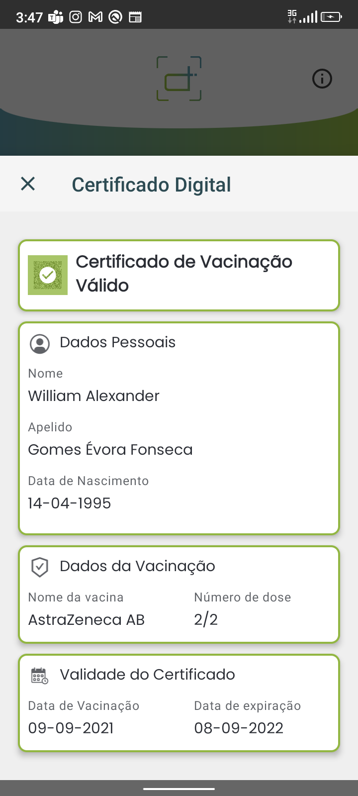

# Certificado de Vacinação Válido / Valid Vaccine Certificate

## Decode Chain

### QR Code de teste / Test QR Code

### Conteúdo / Content

`HC1:NCFOXNYTS3DHTTKHTT /4ERVG+AXKBFS5YUCY4CXG4VT52.IM*498B.VSKQCRRECV4*XUA2PSGH.+HIMI4UU5NITK292W7*RBT1KCG$HQZPQBKLP64-HQ/HQ7IR.SQRDO-B5ET42HPPEPHCRJF2$NICZU.Y0ZW4P-AK.GNNVR*G0C7/JBA93CC7WEB%IJAQ7WC73J7$QBH97UPVUSN77HUW8:Q8FB3KJ3B/S7-SN2H N37J3 QTULJ7CB3ZCL6DOZ0ILDR.TE:2FVA.QO5VA81K0ECM8CCR1+2QEA7IB6$C94JBFD9ORF6/DBLMQOSASM5NKNW0Z.VIUSJ-SGS4/N04QUC.U+OI*JU.ZJ+*PMSBPAP5*Q9*OU IBPKJ*UTV91-ST*QGTAAY7.Y7G+SB.V Q5FN9BOAMH0PZB*RIG%8NNU/:GR/DVX28WD2%J1+4RMS47SBO3.0PGNA45VA/7RAW*E9KIJ1IGG 3  ME8SE5MKJQ*BV%%HJ+PG3RC7V%-3IT9-3EVH7SOPC:TLWLO5T2$J/1OHK5249S+F*8T8CT/7VV2U 1CU-BTYTYGC%MQE-RMQI$1R86IHF4  DA4A 57RWB03J*CS+:U-EW*S0N3WY:2/KM7*LDM3P.D-BA./QY9KV02LGD8 VJH8-M4-1GF7QS16EST:IROZV5XP5.OI/2F1W FLIL3ISC1NR*QLK.OOTLSFJ./BM8L$-IY1SOTS/OI16N//HCCA6H7JZ4X3B8/A2+I9QRJLK1:9+:33+ROOBYBU*E71V60/T7AT4 EADA53WHXL7OOQ.5UJSGWT FIO07JI6P613VVAXKC40/2TE5`

### Step 5 Prefixed

`HC1:NCFOXNYTS3DHTTKHTT /4ERVG+AXKBFS5YUCY4CXG4VT52.IM*498B.VSKQCRRECV4*XUA2PSGH.+HIMI4UU5NITK292W7*RBT1KCG$HQZPQBKLP64-HQ/HQ7IR.SQRDO-B5ET42HPPEPHCRJF2$NICZU.Y0ZW4P-AK.GNNVR*G0C7/JBA93CC7WEB%IJAQ7WC73J7$QBH97UPVUSN77HUW8:Q8FB3KJ3B/S7-SN2H N37J3 QTULJ7CB3ZCL6DOZ0ILDR.TE:2FVA.QO5VA81K0ECM8CCR1+2QEA7IB6$C94JBFD9ORF6/DBLMQOSASM5NKNW0Z.VIUSJ-SGS4/N04QUC.U+OI*JU.ZJ+*PMSBPAP5*Q9*OU IBPKJ*UTV91-ST*QGTAAY7.Y7G+SB.V Q5FN9BOAMH0PZB*RIG%8NNU/:GR/DVX28WD2%J1+4RMS47SBO3.0PGNA45VA/7RAW*E9KIJ1IGG 3  ME8SE5MKJQ*BV%%HJ+PG3RC7V%-3IT9-3EVH7SOPC:TLWLO5T2$J/1OHK5249S+F*8T8CT/7VV2U 1CU-BTYTYGC%MQE-RMQI$1R86IHF4  DA4A 57RWB03J*CS+:U-EW*S0N3WY:2/KM7*LDM3P.D-BA./QY9KV02LGD8 VJH8-M4-1GF7QS16EST:IROZV5XP5.OI/2F1W FLIL3ISC1NR*QLK.OOTLSFJ./BM8L$-IY1SOTS/OI16N//HCCA6H7JZ4X3B8/A2+I9QRJLK1:9+:33+ROOBYBU*E71V60/T7AT4 EADA53WHXL7OOQ.5UJSGWT FIO07JI6P613VVAXKC40/2TE5`

### Step 4 Encoded

`NCFOXNYTS3DHTTKHTT /4ERVG+AXKBFS5YUCY4CXG4VT52.IM*498B.VSKQCRRECV4*XUA2PSGH.+HIMI4UU5NITK292W7*RBT1KCG$HQZPQBKLP64-HQ/HQ7IR.SQRDO-B5ET42HPPEPHCRJF2$NICZU.Y0ZW4P-AK.GNNVR*G0C7/JBA93CC7WEB%IJAQ7WC73J7$QBH97UPVUSN77HUW8:Q8FB3KJ3B/S7-SN2H N37J3 QTULJ7CB3ZCL6DOZ0ILDR.TE:2FVA.QO5VA81K0ECM8CCR1+2QEA7IB6$C94JBFD9ORF6/DBLMQOSASM5NKNW0Z.VIUSJ-SGS4/N04QUC.U+OI*JU.ZJ+*PMSBPAP5*Q9*OU IBPKJ*UTV91-ST*QGTAAY7.Y7G+SB.V Q5FN9BOAMH0PZB*RIG%8NNU/:GR/DVX28WD2%J1+4RMS47SBO3.0PGNA45VA/7RAW*E9KIJ1IGG 3  ME8SE5MKJQ*BV%%HJ+PG3RC7V%-3IT9-3EVH7SOPC:TLWLO5T2$J/1OHK5249S+F*8T8CT/7VV2U 1CU-BTYTYGC%MQE-RMQI$1R86IHF4  DA4A 57RWB03J*CS+:U-EW*S0N3WY:2/KM7*LDM3P.D-BA./QY9KV02LGD8 VJH8-M4-1GF7QS16EST:IROZV5XP5.OI/2F1W FLIL3ISC1NR*QLK.OOTLSFJ./BM8L$-IY1SOTS/OI16N//HCCA6H7JZ4X3B8/A2+I9QRJLK1:9+:33+ROOBYBU*E71V60/T7AT4 EADA53WHXL7OOQ.5UJSGWT FIO07JI6P613VVAXKC40/2TE5`

### Step 3 Compressed

`[120, -38, -69, -44, -30, -73, -120, -59, -93, 106, -22, -113, 39, 87, -6, 4, 86, 50, 90, -88, 44, -120, 100, 84, 95, -62, 34, -107, 44, -59, -107, -58, 38, -107, 88, 116, -29, 25, 99, -110, 115, -104, 37, 35, -13, 66, -58, 37, -119, 101, -115, -85, -110, 82, -14, -104, -110, 114, 19, 115, -3, -125, -36, 117, 13, 13, -128, -64, -48, -52, -46, 50, -87, -84, 32, -53, -48, -48, -48, -46, -40, -60, -46, -64, -64, 60, 41, -91, 36, -53, -56, -64, -56, 80, -41, -64, 18, -120, -110, -110, -13, -127, 6, 36, 37, 103, 86, 104, -122, 6, -7, 89, -123, -122, 57, 123, 90, -123, 25, 90, 57, -121, 89, -103, -103, -101, 59, -5, 57, -101, 58, -71, 91, -70, 57, 5, -7, -70, -70, -7, -121, -69, 69, 6, 68, 6, 25, -71, 27, 38, -27, 22, -28, -72, -122, -22, 27, -22, 27, 25, -22, 27, -102, 26, 89, 38, 101, 22, 103, -8, 6, 63, 106, -104, -20, -30, 23, -100, 84, -100, -62, -108, 84, -110, -98, 105, 97, 98, 96, 106, 12, -76, -50, 44, 57, 47, 49, 119, 73, 114, 90, 94, 73, -119, 123, 126, 110, 106, -79, -62, -31, -50, -78, -4, -94, 68, 5, -73, -4, -68, -30, -44, -28, -60, 36, -96, 4, 54, -15, -28, -12, -68, -110, -62, -16, -52, -100, -100, -52, -60, 92, 5, -57, -100, -44, -118, -60, -68, -108, -44, -94, -92, -12, 60, 76, -63, -28, -78, -44, -94, 84, 67, 61, 99, 61, -125, -28, -108, -4, -92, 44, 67, 75, 75, 83, 93, 3, 19, 93, 67, -109, 72, 70, 6, -15, 112, -122, 119, 110, 127, 21, -66, 108, 125, -100, -5, 38, -83, -31, 117, -34, -69, 27, -2, -59, -21, 83, 53, -10, 28, 62, -8, -2, -3, 73, -50, -103, -119, -127, -69, 30, 31, -76, 126, -34, -14, -82, -11, -47, 21, -9, 77, -115, 77, -52, -36, -42, 42, -10, 126, 31, 22, 76, 92, 111, 110, 58, 123, -54, 21, -19, 45, -85, -46, -26, 94, -100, -50, -66, 48, 43, 34, 71, -25, 125, -53, -26, -12, -25, -119, -10, -99, -19, -57, 95, 61, 94, 86, -21, 124, 97, -34, -47, -82, -36, -42, -109, 10, -43, -27, -113, 120, 34, 88, 109, 77, 79, -40, 56, 100, 92, -66, -106, -46, -33, -65, -11, 50, -1, -65, 5, 19, -3, -66, 23, -80, -79, -75, -84, -1, 27, -90, 110, 80, 81, 50, -43, 99, -97, -21, 15, -15, 105, -70, -5, -109, 66, 88, 35, -85, 126, -26, -50, -12, 47, -65, -22, 95, -40, -23, -5, 118, -53, -109, -59, 63, 23, 115, -3, 92, -88, -28, 27, 126, 99, -22, -39, -97, -86, -42, -59, 78, -85, 78, -103, 10, 94, -68, -89, -101, -107, -68, -35, -53, -30, -83, -110, -59, -74, -2, -114, 51, 81, 66, 58, 98, 37, -34, 87, -85, 86, -79, -107, 108, -38, 46, -95, -8, 78, -18, 31, -97, -36, -98, 91, 83, -17, 95, 57, -4, 52, -22, -20, -12, -25, 46, 117, 22, 81, 109, -3, -84, -85, -5, -62, 23, 47, 9, -32, -15, -21, 21, -111, 41, 55, 119, 50, -77, 9, 16, -6, -83, -92, 11, 0, -64, -27, -22, -17]`

### Step 2 Cose

`[-46, -124, 78, -94, 4, 72, 122, -107, -8, -28, -44, -114, 16, -87, 1, 56, 36, -96, 89, 1, 39, -92, 4, 26, 99, 26, 10, 102, 6, 26, 97, 114, -40, -26, 1, 98, 67, 86, 57, 1, 3, -95, 1, -92, 97, 118, -127, -86, 98, 100, 110, 2, 98, 109, 97, 109, 79, 82, 71, 45, 49, 48, 48, 48, 48, 49, 54, 57, 57, 98, 118, 112, 106, 49, 49, 49, 57, 51, 52, 57, 48, 48, 55, 98, 100, 116, 106, 50, 48, 50, 49, 45, 48, 57, 45, 48, 57, 98, 99, 111, 98, 67, 86, 98, 99, 105, 120, 41, 85, 82, 78, 58, 85, 86, 67, 73, 58, 86, 49, 58, 67, 86, 58, 54, 55, 55, 67, 78, 67, 53, 66, 71, 57, 70, 66, 82, 77, 69, 70, 79, 87, 70, 89, 80, 89, 82, 50, 71, 49, 98, 109, 112, 108, 69, 85, 47, 49, 47, 50, 49, 47, 49, 53, 50, 57, 98, 105, 115, 104, 77, 83, -30, -128, -109, 68, 78, 83, 98, 115, 100, 2, 98, 116, 103, 105, 56, 52, 48, 53, 51, 57, 48, 48, 54, 99, 110, 97, 109, -92, 99, 102, 110, 116, 116, 71, 111, 109, 101, 115, 32, -61, -119, 118, 111, 114, 97, 32, 70, 111, 110, 115, 101, 99, 97, 98, 102, 110, 116, 71, 111, 109, 101, 115, 32, -61, -119, 118, 111, 114, 97, 32, 70, 111, 110, 115, 101, 99, 97, 99, 103, 110, 116, 113, 87, 105, 108, 108, 105, 97, 109, 32, 65, 108, 101, 120, 97, 110, 100, 101, 114, 98, 103, 110, 113, 87, 105, 108, 108, 105, 97, 109, 32, 65, 108, 101, 120, 97, 110, 100, 101, 114, 99, 118, 101, 114, 101, 49, 46, 51, 46, 48, 99, 100, 111, 98, 106, 49, 57, 57, 53, 45, 48, 52, 45, 49, 52, 89, 1, 0, 23, 87, 0, -18, 70, -3, 32, -12, -75, -29, 109, -20, 102, -128, -21, 110, -18, -40, 79, 115, -81, 101, 40, -68, -61, -63, -17, -17, -55, 9, -103, 97, 81, -70, -29, -63, 59, -25, -124, -18, -123, -30, -44, 71, -78, -127, -126, 3, 11, 59, 36, 63, 78, -16, -96, -111, -81, 55, 53, -101, -108, -44, 43, -76, -86, 102, -99, -47, -105, 7, -95, 106, 88, 108, 44, -17, -124, -77, 103, -25, 97, 63, -119, -121, -57, -22, -29, -90, 125, 67, -48, -98, -59, -118, 109, -123, -55, 32, 123, 119, -30, 12, 88, 5, 61, 53, -56, 60, 64, 104, -45, -42, 100, -113, -113, -75, -45, 15, -2, -96, -111, 78, -9, 112, 6, 6, -124, -81, -3, 86, 39, 48, 120, 116, -107, 72, -66, 69, -8, 23, -106, 45, -65, 98, 84, 5, 89, 122, -7, 109, -103, 79, 119, -43, 79, 113, -119, 77, -19, -76, -28, -93, -7, -93, 10, -7, -95, 34, 77, 87, -40, -107, -51, -7, 37, 59, 115, 66, -86, -54, 53, 17, -47, -34, 45, 106, 99, -73, 74, 56, -19, 34, 56, -74, -113, -120, -52, 90, 18, 44, 22, 116, 75, -43, 122, -86, 6, 116, -78, -73, 24, 33, -18, 30, -2, 14, 30, -68, -38, -107, -33, -44, -61, -27, 90, -51, -105, -25, 68, 126, 56, 90, -122, -113, 5, -85, -114, 87, -93, -92, 80, 12, 78, -115, 20, 28, 119, 55, 66, 54, 60, 80, 18, -5, 34, 45]`

### Step 1 Cwt

`[-92, 4, 26, 99, 26, 10, 102, 6, 26, 97, 114, -40, -26, 1, 98, 67, 86, 57, 1, 3, -95, 1, -92, 97, 118, -127, -86, 98, 100, 110, 2, 98, 109, 97, 109, 79, 82, 71, 45, 49, 48, 48, 48, 48, 49, 54, 57, 57, 98, 118, 112, 106, 49, 49, 49, 57, 51, 52, 57, 48, 48, 55, 98, 100, 116, 106, 50, 48, 50, 49, 45, 48, 57, 45, 48, 57, 98, 99, 111, 98, 67, 86, 98, 99, 105, 120, 41, 85, 82, 78, 58, 85, 86, 67, 73, 58, 86, 49, 58, 67, 86, 58, 54, 55, 55, 67, 78, 67, 53, 66, 71, 57, 70, 66, 82, 77, 69, 70, 79, 87, 70, 89, 80, 89, 82, 50, 71, 49, 98, 109, 112, 108, 69, 85, 47, 49, 47, 50, 49, 47, 49, 53, 50, 57, 98, 105, 115, 104, 77, 83, -30, -128, -109, 68, 78, 83, 98, 115, 100, 2, 98, 116, 103, 105, 56, 52, 48, 53, 51, 57, 48, 48, 54, 99, 110, 97, 109, -92, 99, 102, 110, 116, 116, 71, 111, 109, 101, 115, 32, -61, -119, 118, 111, 114, 97, 32, 70, 111, 110, 115, 101, 99, 97, 98, 102, 110, 116, 71, 111, 109, 101, 115, 32, -61, -119, 118, 111, 114, 97, 32, 70, 111, 110, 115, 101, 99, 97, 99, 103, 110, 116, 113, 87, 105, 108, 108, 105, 97, 109, 32, 65, 108, 101, 120, 97, 110, 100, 101, 114, 98, 103, 110, 113, 87, 105, 108, 108, 105, 97, 109, 32, 65, 108, 101, 120, 97, 110, 100, 101, 114, 99, 118, 101, 114, 101, 49, 46, 51, 46, 48, 99, 100, 111, 98, 106, 49, 57, 57, 53, 45, 48, 52, 45, 49, 52]`

### Raw

`{"v":[{"dn":2,"ma":"ORG-100001699","vp":"1119349007","dt":"2021-09-09","co":"CV","ci":"URN:UVCI:V1:CV:677CNC5BG9FBRMEFOWFYPYR2G1","mp":"EU/1/21/1529","is":"MS–DNS","sd":2,"tg":"840539006"}],"nam":{"fnt":"Gomes Évora Fonseca","fn":"Gomes Évora Fonseca","gnt":"William Alexander","gn":"William Alexander"},"ver":"1.3.0","dob":"1995-04-14"}`

### Resultado / Result

