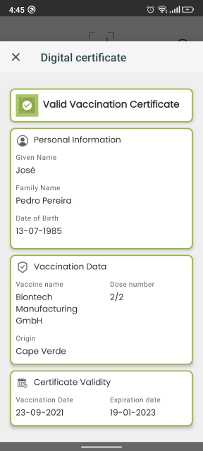

# Certificado de Vacinação Válido / Valid Vaccine Certificate

## Decode Chain

### QR Code de teste / Test QR Code

### Conteúdo / Content

`HC1:NCFA60NG0/3WUWGVLKE797/IZ-S8/HKGLH479CKV503XK5F37LP %K3F3HGTNU40JCN+AY50.FK6ZK7:EDOLFVCPD0B$D% D3IA4W5646946846.966KCN9E%961A6DL6FA7D46XJCCWENF6OF63W5CA7QF6WJCT3E3N8WJC0FD6A5AIA%G7X+AQB9F+AKG7O+AJ%6H:6A+9:W6809V*89IA4Y8G1A9+847ARHA009.JCP9EJY8L/5M/5 96.96WF6%JCOQE+Y9OSSZRIQ+93KC.SC4KCD3DX47B46IL6646I*6..DX%DLPCG/D* D2Y8BIA5S7GY87Y8.HAZJC9/DG7AJVC82EG7AZKE*ED1ECI3D6WEXH9WNA JC1/DKI9PSESILO/EZKEZ967L6C56GVC*JC1A6Y473W5+/6+96FBBO10Q+0 $U19MBBSNKL$-J4*LV3C/%H*-OLGTNZ4LUSGY1%+SX8B4C0PMTAHPVLVP383 S/.KBZ3+7RDDG- 6.Y3+B0CB4JICT-O5N0GO4Y*MMF6QYQL5BLIEOMQUZ7M3K7DIPJQ.LMCSMX3WC*2REP90RU6UVBRX*NPLK263$R6R$QL$8.4HA2C*RR.ML3W9PCNAYCFKK+TMVMOQ3AG9BWK5/E9EVJXEEIHASRC+F5DEOVPFIZEYNS+ZKMI0NGG$62AEJ 2BP:OE6QVO5QC6DYOXB7CH45:KFS1CDD JR2M3P2WU8F ZIUTHZV5$SUYIHM FI 2VKF0.M4+KKN7DDABSE3W30BO$MEAIE:.1GRFF44FDRHZEL-60U6W+PGODJTJYFL.1`

### Step 5 Prefixed

`HC1:NCFA60NG0/3WUWGVLKE797/IZ-S8/HKGLH479CKV503XK5F37LP %K3F3HGTNU40JCN+AY50.FK6ZK7:EDOLFVCPD0B$D% D3IA4W5646946846.966KCN9E%961A6DL6FA7D46XJCCWENF6OF63W5CA7QF6WJCT3E3N8WJC0FD6A5AIA%G7X+AQB9F+AKG7O+AJ%6H:6A+9:W6809V*89IA4Y8G1A9+847ARHA009.JCP9EJY8L/5M/5 96.96WF6%JCOQE+Y9OSSZRIQ+93KC.SC4KCD3DX47B46IL6646I*6..DX%DLPCG/D* D2Y8BIA5S7GY87Y8.HAZJC9/DG7AJVC82EG7AZKE*ED1ECI3D6WEXH9WNA JC1/DKI9PSESILO/EZKEZ967L6C56GVC*JC1A6Y473W5+/6+96FBBO10Q+0 $U19MBBSNKL$-J4*LV3C/%H*-OLGTNZ4LUSGY1%+SX8B4C0PMTAHPVLVP383 S/.KBZ3+7RDDG- 6.Y3+B0CB4JICT-O5N0GO4Y*MMF6QYQL5BLIEOMQUZ7M3K7DIPJQ.LMCSMX3WC*2REP90RU6UVBRX*NPLK263$R6R$QL$8.4HA2C*RR.ML3W9PCNAYCFKK+TMVMOQ3AG9BWK5/E9EVJXEEIHASRC+F5DEOVPFIZEYNS+ZKMI0NGG$62AEJ 2BP:OE6QVO5QC6DYOXB7CH45:KFS1CDD JR2M3P2WU8F ZIUTHZV5$SUYIHM FI 2VKF0.M4+KKN7DDABSE3W30BO$MEAIE:.1GRFF44FDRHZEL-60U6W+PGODJTJYFL.1`

### Step 4 Encoded

`NCFA60NG0/3WUWGVLKE797/IZ-S8/HKGLH479CKV503XK5F37LP %K3F3HGTNU40JCN+AY50.FK6ZK7:EDOLFVCPD0B$D% D3IA4W5646946846.966KCN9E%961A6DL6FA7D46XJCCWENF6OF63W5CA7QF6WJCT3E3N8WJC0FD6A5AIA%G7X+AQB9F+AKG7O+AJ%6H:6A+9:W6809V*89IA4Y8G1A9+847ARHA009.JCP9EJY8L/5M/5 96.96WF6%JCOQE+Y9OSSZRIQ+93KC.SC4KCD3DX47B46IL6646I*6..DX%DLPCG/D* D2Y8BIA5S7GY87Y8.HAZJC9/DG7AJVC82EG7AZKE*ED1ECI3D6WEXH9WNA JC1/DKI9PSESILO/EZKEZ967L6C56GVC*JC1A6Y473W5+/6+96FBBO10Q+0 $U19MBBSNKL$-J4*LV3C/%H*-OLGTNZ4LUSGY1%+SX8B4C0PMTAHPVLVP383 S/.KBZ3+7RDDG- 6.Y3+B0CB4JICT-O5N0GO4Y*MMF6QYQL5BLIEOMQUZ7M3K7DIPJQ.LMCSMX3WC*2REP90RU6UVBRX*NPLK263$R6R$QL$8.4HA2C*RR.ML3W9PCNAYCFKK+TMVMOQ3AG9BWK5/E9EVJXEEIHASRC+F5DEOVPFIZEYNS+ZKMI0NGG$62AEJ 2BP:OE6QVO5QC6DYOXB7CH45:KFS1CDD JR2M3P2WU8F ZIUTHZV5$SUYIHM FI 2VKF0.M4+KKN7DDABSE3W30BO$MEAIE:.1GRFF44FDRHZEL-60U6W+PGODJTJYFL.1`

### Step 3 Compressed

`[120, -38, 1, 24, 2, -25, -3, -46, -124, 78, -94, 4, 72, 122, -107, -8, -28, -44, -114, 16, -87, 1, 56, 36, -96, 89, 1, 0, -92, 4, 26, 99, -55, 121, -91, 6, 26, 97, -24, 70, 37, 1, 98, 67, 86, 57, 1, 3, -95, 1, -92, 97, 118, -127, -86, 98, 100, 110, 2, 98, 109, 97, 109, 79, 82, 71, 45, 49, 48, 48, 48, 51, 48, 50, 49, 53, 98, 118, 112, 106, 49, 49, 49, 57, 51, 52, 57, 48, 48, 55, 98, 100, 116, 106, 50, 48, 50, 49, 45, 48, +447 more]`

### Step 2 Cose

`[-46, -124, 78, -94, 4, 72, 122, -107, -8, -28, -44, -114, 16, -87, 1, 56, 36, -96, 89, 1, 0, -92, 4, 26, 99, -55, 121, -91, 6, 26, 97, -24, 70, 37, 1, 98, 67, 86, 57, 1, 3, -95, 1, -92, 97, 118, -127, -86, 98, 100, 110, 2, 98, 109, 97, 109, 79, 82, 71, 45, 49, 48, 48, 48, 51, 48, 50, 49, 53, 98, 118, 112, 106, 49, 49, 49, 57, 51, 52, 57, 48, 48, 55, 98, 100, 116, 106, 50, 48, 50, 49, 45, 48, 57, 45, 50, 51, 98, 99, 111, +436 more]`

### Step 1 Cwt

`[-92, 4, 26, 99, -55, 121, -91, 6, 26, 97, -24, 70, 37, 1, 98, 67, 86, 57, 1, 3, -95, 1, -92, 97, 118, -127, -86, 98, 100, 110, 2, 98, 109, 97, 109, 79, 82, 71, 45, 49, 48, 48, 48, 51, 48, 50, 49, 53, 98, 118, 112, 106, 49, 49, 49, 57, 51, 52, 57, 48, 48, 55, 98, 100, 116, 106, 50, 48, 50, 49, 45, 48, 57, 45, 50, 51, 98, 99, 111, 98, 67, 86, 98, 99, 105, 120, 41, 85, 82, 78, 58, 85, 86, 67, 73, 58, 86, 49, 58, 67, +156 more]`

### Raw

`{"v":[{"dn":2,"ma":"ORG-100030215","vp":"1119349007","dt":"2021-09-23","co":"CV","ci":"URN:UVCI:V1:CV:677CNC5BG9FBRMEFOWFYPYR2G1","mp":"EU/1/21/1529","is":"MS–DNS","sd":2,"tg":"840539006"}],"nam":{"fnt":"PEDRO<PEREIRA","fn":"Pedro Pereira","gnt":"JOSE","gn":"José"},"ver":"1.3.0","dob":"1985-07-13"}`

### Resultado / Result

