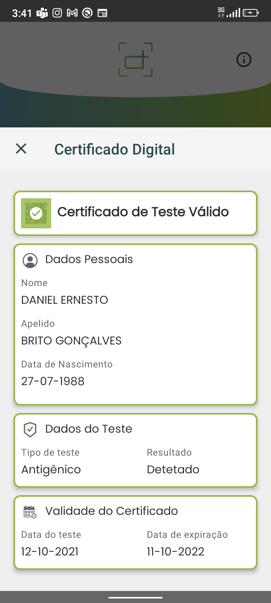

# Certificado de Test Válido / Valid Test Certificate

## Decode Chain

### QR Code de teste / Test QR Code

### Conteúdo / Content

`HC1:NCFOXNYTS3DHTTKHTT /4ERVG+AXKBFS5+WCSFBXG4J.T38W:X94MM9PP92P9ATAN9I6T5XH3E2%E3T 4A05423423ZQT3I3MD37$G2NJ$7386B233 X48YISLV423VLJ0JBIFT/15B/S5A7.03*K5V*CU7JL%4A55C4T2$TM*4XQ4KFPQ$S3/26:IF4T9CNJLTC77T9TB6JV5T1%SNJVI3JJK5SZ4U.4ZW4P-AK.GNNVR*G0C7/JBA93CC7JBBVNN$.0EWJ9FN6$0* 07YVZWVWNN.L73$00INUTN3ZCL6DOZ0ILDR.TE:25VA81K0ECM8CXVDC8C90JZJAPEDI.C%VDOVDN9C$ZJ*DJ3Q4+Y5B$KVC5MO6X4C92S6CUKWN 2A9QDMIAT%378B6LF D9HTHB8K:UL.LGXCI9QDNBH9JA4*3679UDBQEAJJKKKMEC8ZI9:GA3IQD*2B*0VONU6TWVHAUUZ-R:RS57S7TPQND*$HT34ANS.F9M5UWVRYY0MCQE47C7A8-IN1HJ%N::76-QXP5$94*L1$NA4UJ-+1O5SB*ML+7*SGUFDKSFENQI1U AR*.TMVDJYFE+TFEVFRO2:J$-J+1VYV2W2IKAF7PSOYLN/0+ZJIITPDWM19 CAM/K/*1CPI:KL7P7Q$5/NEN898$P59WTP8HAPI$TD-7G6N.XRIM8%:K1R39O676DRB46YQIU3ABMJZ7 /S*GLPY4T6VUYU:JKMFD: 1T02CAQC:QQYK-NK40VABN1P9HE37C0IQR$NL+E7MZQ-JMVPP8WJ7NT3AOL8E-549%PVFN4Q9X566ROW UPP7N$7PZ7D-3Y+J*UJB7RT4E-OV84I.1O0 MRTTL*SGZTIF9H.BKX5530S38/0`

### Step 5 Prefixed

`HC1:NCFOXNYTS3DHTTKHTT /4ERVG+AXKBFS5+WCSFBXG4J.T38W:X94MM9PP92P9ATAN9I6T5XH3E2%E3T 4A05423423ZQT3I3MD37$G2NJ$7386B233 X48YISLV423VLJ0JBIFT/15B/S5A7.03*K5V*CU7JL%4A55C4T2$TM*4XQ4KFPQ$S3/26:IF4T9CNJLTC77T9TB6JV5T1%SNJVI3JJK5SZ4U.4ZW4P-AK.GNNVR*G0C7/JBA93CC7JBBVNN$.0EWJ9FN6$0* 07YVZWVWNN.L73$00INUTN3ZCL6DOZ0ILDR.TE:25VA81K0ECM8CXVDC8C90JZJAPEDI.C%VDOVDN9C$ZJ*DJ3Q4+Y5B$KVC5MO6X4C92S6CUKWN 2A9QDMIAT%378B6LF D9HTHB8K:UL.LGXCI9QDNBH9JA4*3679UDBQEAJJKKKMEC8ZI9:GA3IQD*2B*0VONU6TWVHAUUZ-R:RS57S7TPQND*$HT34ANS.F9M5UWVRYY0MCQE47C7A8-IN1HJ%N::76-QXP5$94*L1$NA4UJ-+1O5SB*ML+7*SGUFDKSFENQI1U AR*.TMVDJYFE+TFEVFRO2:J$-J+1VYV2W2IKAF7PSOYLN/0+ZJIITPDWM19 CAM/K/*1CPI:KL7P7Q$5/NEN898$P59WTP8HAPI$TD-7G6N.XRIM8%:K1R39O676DRB46YQIU3ABMJZ7 /S*GLPY4T6VUYU:JKMFD: 1T02CAQC:QQYK-NK40VABN1P9HE37C0IQR$NL+E7MZQ-JMVPP8WJ7NT3AOL8E-549%PVFN4Q9X566ROW UPP7N$7PZ7D-3Y+J*UJB7RT4E-OV84I.1O0 MRTTL*SGZTIF9H.BKX5530S38/0`

### Step 4 Encoded

`NCFOXNYTS3DHTTKHTT /4ERVG+AXKBFS5+WCSFBXG4J.T38W:X94MM9PP92P9ATAN9I6T5XH3E2%E3T 4A05423423ZQT3I3MD37$G2NJ$7386B233 X48YISLV423VLJ0JBIFT/15B/S5A7.03*K5V*CU7JL%4A55C4T2$TM*4XQ4KFPQ$S3/26:IF4T9CNJLTC77T9TB6JV5T1%SNJVI3JJK5SZ4U.4ZW4P-AK.GNNVR*G0C7/JBA93CC7JBBVNN$.0EWJ9FN6$0* 07YVZWVWNN.L73$00INUTN3ZCL6DOZ0ILDR.TE:25VA81K0ECM8CXVDC8C90JZJAPEDI.C%VDOVDN9C$ZJ*DJ3Q4+Y5B$KVC5MO6X4C92S6CUKWN 2A9QDMIAT%378B6LF D9HTHB8K:UL.LGXCI9QDNBH9JA4*3679UDBQEAJJKKKMEC8ZI9:GA3IQD*2B*0VONU6TWVHAUUZ-R:RS57S7TPQND*$HT34ANS.F9M5UWVRYY0MCQE47C7A8-IN1HJ%N::76-QXP5$94*L1$NA4UJ-+1O5SB*ML+7*SGUFDKSFENQI1U AR*.TMVDJYFE+TFEVFRO2:J$-J+1VYV2W2IKAF7PSOYLN/0+ZJIITPDWM19 CAM/K/*1CPI:KL7P7Q$5/NEN898$P59WTP8HAPI$TD-7G6N.XRIM8%:K1R39O676DRB46YQIU3ABMJZ7 /S*GLPY4T6VUYU:JKMFD: 1T02CAQC:QQYK-NK40VABN1P9HE37C0IQR$NL+E7MZQ-JMVPP8WJ7NT3AOL8E-549%PVFN4Q9X566ROW UPP7N$7PZ7D-3Y+J*UJB7RT4E-OV84I.1O0 MRTTL*SGZTIF9H.BKX5530S38/0`

### Step 3 Compressed

`[120, -38, -69, -44, -30, -73, -120, -59, -93, 106, -22, -113, 39, 87, -6, 4, 86, 50, 90, -88, 44, -120, 100, -76, 89, -62, 34, -107, -20, -38, -2, -117, 77, 42, -79, -24, -54, 47, -58, 36, -25, 48, 75, 70, -26, -123, -116, 75, 18, 75, 26, 87, 38, 21, 39, -105, 24, 25, 24, 25, -22, 26, 26, -24, 26, 26, -123, 24, -102, 88, 25, 27, 88, 25, 24, 68, 37, -107, -108, 100, -7, 4, 24, 25, -102, 27, 90, 90, -24, 26, 39, -27, -27, 22, 57, 38, 23, -27, 43, 56, 101, -26, -105, -92, 38, 103, 40, 120, -26, 37, -21, -24, 38, -107, 36, 87, -56, 120, -28, 23, 23, 100, -106, 36, -26, 40, -72, 20, -23, 41, 56, -90, -25, 23, -105, 100, -26, 101, -28, 43, -8, -91, -106, -28, 43, 36, 37, -25, 39, 36, 37, 103, 86, 104, -122, 6, -7, 89, -123, -122, 57, 123, 90, -123, 25, 90, 57, -121, 89, 5, -70, 25, 7, -121, -101, -7, -72, -101, 6, -121, 6, 123, -5, 56, -6, -6, -70, 26, 59, 58, 6, -124, -71, 25, -69, 38, 101, 22, 103, -8, 6, 63, 106, -104, -20, -30, 23, -100, 84, -110, -98, 105, 97, 98, 96, 106, 108, 105, 96, 96, -106, 84, 82, -108, 105, 100, 102, 96, 108, 110, 108, 96, 96, -104, -100, -105, -104, -69, 36, 57, 45, -81, -92, -64, 41, -56, 51, -60, 95, -63, -35, -33, -17, 112, -69, -93, 79, -104, 107, 112, 82, 90, 30, -122, 88, 114, 122, 94, 73, -98, -117, -93, -97, -89, -85, -113, -126, 107, -112, -97, 107, 112, -120, 127, 82, 122, 30, -102, 72, 114, 89, 106, 81, -86, -95, -98, -79, -98, 65, 114, 74, 126, 82, 22, -48, -41, 22, -70, 6, -26, -70, 70, -26, -111, -116, 12, -14, -98, -36, -21, -30, 103, -34, -68, -54, -31, 106, -6, -115, 33, 32, 72, -31, -111, 73, -2, -18, 69, -37, 38, 6, 28, -49, -36, 56, 33, 80, 97, -107, -97, -122, -67, -68, -80, 63, 71, -44, -27, 44, 19, 33, 94, 11, -63, 83, 74, -101, -107, 15, 26, -34, 117, -76, -20, 62, 124, -125, -93, 105, -106, 123, -89, -47, -61, -19, -115, -41, 121, -20, -18, 108, 94, 124, -76, -20, 123, -9, -68, -62, -90, -98, 9, -99, -91, -11, -116, 21, 103, -114, -36, 120, 125, -31, -24, -84, 47, 7, -90, -100, -102, -24, -95, -1, -126, 71, 116, 81, 90, -91, -39, 14, -17, -110, -45, -87, -51, 59, -53, 46, 40, 114, -12, 72, -80, -52, 74, -2, -70, 67, -54, -57, -108, -21, -8, 62, -95, -73, 13, -37, -118, 67, 56, -90, 22, 28, 123, 51, -73, 103, -22, 33, -82, -45, -86, 29, 19, -81, -1, 61, -103, -27, 47, -87, 20, 37, -73, -10, 98, -13, 102, -95, -73, 105, -114, 14, 105, 15, -17, -49, 120, -43, 114, -92, 72, -94, 104, -11, 59, -73, -24, 75, -105, 26, 66, 2, 35, -38, 55, -86, 77, 57, -3, -45, -25, -79, -122, -54, 69, -101, -13, -23, 119, -65, -99, 112, 59, 32, -82, -52, 120, -72, -79, 75, -57, 48, 120, -62, -99, -13, -62, 59, -35, 61, -9, 61, -97, 30, -3, -99, 117, -101, -72, -42, -39, 111, -113, -7, -104, -113, 30, -66, 47, -76, 90, -22, -103, -28, 108, -21, -100, 73, -26, 94, 118, 45, 110, 0, -116, 63, -21, 43]`

### Step 2 Cose

`[-46, -124, 78, -94, 4, 72, 122, -107, -8, -28, -44, -114, 16, -87, 1, 56, 36, -96, 89, 1, 60, -92, 4, 26, 99, 69, -121, -6, 6, 26, 97, 114, -44, -6, 1, 98, 67, 86, 57, 1, 3, -95, 1, -92, 97, 116, -127, -87, 98, 115, 99, 116, 50, 48, 50, 49, 45, 49, 48, 45, 49, 50, 84, 49, 52, 58, 51, 48, 58, 48, 48, 90, 98, 116, 116, 106, 76, 80, 50, 49, 55, 49, 57, 56, 45, 51, 98, 110, 109, 114, 65, 99, 114, 111, 32, 66, 105, 111, 116, 101, 99, 104, 32, 73, 110, 99, 44, 45, 98, 116, 99, 120, 28, 72, 111, 115, 112, 105, 116, 97, 108, 32, 68, 114, 46, 32, 65, 103, 111, 115, 116, 105, 110, 104, 111, 32, 78, 101, 116, 111, 32, 98, 99, 111, 96, 98, 99, 105, 120, 41, 85, 82, 78, 58, 85, 86, 67, 73, 58, 86, 49, 58, 67, 86, 58, 81, 70, 51, 83, 87, 54, 76, 71, 53, 83, 85, 83, 75, 76, 65, 77, 77, 69, 51, 65, 65, 80, 86, 70, 51, 69, 98, 105, 115, 104, 77, 83, -30, -128, -109, 68, 78, 83, 98, 116, 103, 105, 56, 52, 48, 53, 51, 57, 48, 48, 54, 98, 116, 114, 105, 50, 54, 48, 51, 55, 51, 48, 48, 49, 99, 110, 97, 109, -92, 99, 102, 110, 116, 112, 66, 82, 73, 84, 79, 32, 71, 79, 78, -61, -121, 65, 76, 86, 69, 83, 98, 102, 110, 112, 66, 82, 73, 84, 79, 32, 71, 79, 78, -61, -121, 65, 76, 86, 69, 83, 99, 103, 110, 116, 110, 68, 65, 78, 73, 69, 76, 32, 69, 82, 78, 69, 83, 84, 79, 98, 103, 110, 110, 68, 65, 78, 73, 69, 76, 32, 69, 82, 78, 69, 83, 84, 79, 99, 118, 101, 114, 101, 49, 46, 51, 46, 48, 99, 100, 111, 98, 106, 49, 57, 56, 56, 45, 48, 55, 45, 50, 55, 89, 1, 0, 31, 73, 11, -82, 95, -103, -39, -43, 8, 69, 53, -10, 0, 80, 82, 32, -30, 52, 111, -69, -94, -74, -111, 80, -57, 105, -79, -112, 81, 32, -86, 78, 40, 63, 31, 19, 79, 8, 90, -45, 106, 52, 18, 13, 56, 17, -54, 34, -77, 35, -63, 49, -35, 65, 57, -117, -61, -40, 8, -126, -102, 71, -119, 50, -31, -73, -127, -41, 12, 62, -36, -77, -93, -59, 118, -9, -117, -98, 113, -126, -116, -112, -119, 117, 127, 1, 120, -52, -60, -40, -21, -48, -59, -102, -12, -64, -108, -54, -111, 72, 47, -24, 12, 21, -94, 102, 121, 54, -72, 75, 116, -53, 101, -125, -71, 118, -48, 33, 8, -116, 24, 4, -102, 99, -11, -72, 26, 76, 53, 10, -57, -66, 18, -19, -128, -74, 115, 84, 8, -107, 112, -58, -20, -99, -116, -107, -62, 10, -53, 37, -120, -111, -41, -3, -55, 106, 79, 25, 34, 90, 30, -83, -47, -125, -77, 18, -19, 102, 65, 64, 102, -31, -33, -104, -22, -124, -60, 114, 24, 114, -85, -18, 70, 91, -46, -46, -128, 84, 81, 88, -121, -79, 38, -108, -53, -7, 76, -29, 40, 36, -47, 60, -49, 103, -35, -10, -56, 70, -64, 23, 35, 1, -61, -127, -118, 44, 49, 83, -112, -36, -49, 19, -71, 71, 73, -66, -25, -105, 91, -9, 5, -74, 23, 42, -51, -10, -29, 14, 3, -59, -61, -33, 18, -85, 26, -26, 25, -101, 59, 108, -110, 55, 74, 62, -124, 70]`

### Step 1 Cwt

`[-92, 4, 26, 99, 69, -121, -6, 6, 26, 97, 114, -44, -6, 1, 98, 67, 86, 57, 1, 3, -95, 1, -92, 97, 116, -127, -87, 98, 115, 99, 116, 50, 48, 50, 49, 45, 49, 48, 45, 49, 50, 84, 49, 52, 58, 51, 48, 58, 48, 48, 90, 98, 116, 116, 106, 76, 80, 50, 49, 55, 49, 57, 56, 45, 51, 98, 110, 109, 114, 65, 99, 114, 111, 32, 66, 105, 111, 116, 101, 99, 104, 32, 73, 110, 99, 44, 45, 98, 116, 99, 120, 28, 72, 111, 115, 112, 105, 116, 97, 108, 32, 68, 114, 46, 32, 65, 103, 111, 115, 116, 105, 110, 104, 111, 32, 78, 101, 116, 111, 32, 98, 99, 111, 96, 98, 99, 105, 120, 41, 85, 82, 78, 58, 85, 86, 67, 73, 58, 86, 49, 58, 67, 86, 58, 81, 70, 51, 83, 87, 54, 76, 71, 53, 83, 85, 83, 75, 76, 65, 77, 77, 69, 51, 65, 65, 80, 86, 70, 51, 69, 98, 105, 115, 104, 77, 83, -30, -128, -109, 68, 78, 83, 98, 116, 103, 105, 56, 52, 48, 53, 51, 57, 48, 48, 54, 98, 116, 114, 105, 50, 54, 48, 51, 55, 51, 48, 48, 49, 99, 110, 97, 109, -92, 99, 102, 110, 116, 112, 66, 82, 73, 84, 79, 32, 71, 79, 78, -61, -121, 65, 76, 86, 69, 83, 98, 102, 110, 112, 66, 82, 73, 84, 79, 32, 71, 79, 78, -61, -121, 65, 76, 86, 69, 83, 99, 103, 110, 116, 110, 68, 65, 78, 73, 69, 76, 32, 69, 82, 78, 69, 83, 84, 79, 98, 103, 110, 110, 68, 65, 78, 73, 69, 76, 32, 69, 82, 78, 69, 83, 84, 79, 99, 118, 101, 114, 101, 49, 46, 51, 46, 48, 99, 100, 111, 98, 106, 49, 57, 56, 56, 45, 48, 55, 45, 50, 55]`

### Raw

`{"t":[{"sc":"2021-10-12T14:30:00Z","tt":"LP217198-3","nm":"Acro Biotech Inc,-","tc":"Hospital Dr. Agostinho Neto ","co":"","ci":"URN:UVCI:V1:CV:QF3SW6LG5SUSKLAMME3AAPVF3E","is":"MS–DNS","tg":"840539006","tr":"260373001"}],"nam":{"fnt":"BRITO GONÇALVES","fn":"BRITO GONÇALVES","gnt":"DANIEL ERNESTO","gn":"DANIEL ERNESTO"},"ver":"1.3.0","dob":"1988-07-27"}`

### Resultado / Result

