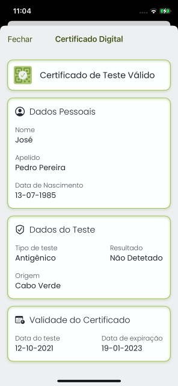

# Certificado de Test Válido / Valid Test Certificate

## Decode Chain

### QR Code de teste / Test QR Code

### Conteúdo / Content

`HC1:NCF170WF0/3WUWGVLKE797/IZ-S8/HKGLH479CKM603XK5F3XLPT013F3.GTW8H0JCN+AY50.FK6ZKZWERILJQE1VE846Y96$964W5EG6-964G7G466468JBMWEWJDA6A:961A6Q47EM69/D:JEXPC82E H824EZ CG7DXC98OC8X55WEC8F379WQE-EDAECP34PJEM34J3D QEZED59DZ347$CT3EUPC0JCJ-AOPCQ8FHZA1+9LZAZM8*G72A63N87G75:6+M8FM82H8$A7DH8QY9:*8M1B4DB6DB1G6.A6+EDG8D9RAKBGQS8GOA9WEQDD+Q6TW6FA7C464KC*KETF6A46.96646C56..DX%DLPCG/D* D2Y8BIA5S7GY87Y8.HAZJC9/DG7AJVC82EG7AZKE*ED1ECI3D6WEXH9WNA JC1/DKI9PSESILO/EZKEZ967L6C56GVC*JC1A6Y473W5+/6+96FBBC20HFJD*7*6GZ+87NBF OXE63MAPVC+1AG%SKFTZQH+8QJFHKZP*64$Q0AP5LJSJ$P-8FDPL*+9I62$79C+1PZAN 3PYJ+SVHN6U/ULXLJIOIH8Y0UMC99/E8J5-Q9:0MF4H  HSBUG5INS9%TS/MVQG91 U5%TUVBB8ASX8ZREX8UT4EXTOE 4E0J+*MZ*MX:AHIPZZADTO%*E98Q2%3FSE5%UWJR0U5V9W4GB1XV3*PZRAAZVJ*2BE0.B5+FNHM00VN%B2ULP:$IH-C604R+ME139 C0II.Q7+XSO1W/HP+9UKLKKA0EOG7TM+FN-A80JNR9ISES373FMGA/VU:M4IDA$2RFPEM3FRP47TVPQDYOCWJMM6$0K799JPMKJUYSK5JG23`

### Step 5 Prefixed

`HC1:NCF170WF0/3WUWGVLKE797/IZ-S8/HKGLH479CKM603XK5F3XLPT013F3.GTW8H0JCN+AY50.FK6ZKZWERILJQE1VE846Y96$964W5EG6-964G7G466468JBMWEWJDA6A:961A6Q47EM69/D:JEXPC82E H824EZ CG7DXC98OC8X55WEC8F379WQE-EDAECP34PJEM34J3D QEZED59DZ347$CT3EUPC0JCJ-AOPCQ8FHZA1+9LZAZM8*G72A63N87G75:6+M8FM82H8$A7DH8QY9:*8M1B4DB6DB1G6.A6+EDG8D9RAKBGQS8GOA9WEQDD+Q6TW6FA7C464KC*KETF6A46.96646C56..DX%DLPCG/D* D2Y8BIA5S7GY87Y8.HAZJC9/DG7AJVC82EG7AZKE*ED1ECI3D6WEXH9WNA JC1/DKI9PSESILO/EZKEZ967L6C56GVC*JC1A6Y473W5+/6+96FBBC20HFJD*7*6GZ+87NBF OXE63MAPVC+1AG%SKFTZQH+8QJFHKZP*64$Q0AP5LJSJ$P-8FDPL*+9I62$79C+1PZAN 3PYJ+SVHN6U/ULXLJIOIH8Y0UMC99/E8J5-Q9:0MF4H  HSBUG5INS9%TS/MVQG91 U5%TUVBB8ASX8ZREX8UT4EXTOE 4E0J+*MZ*MX:AHIPZZADTO%*E98Q2%3FSE5%UWJR0U5V9W4GB1XV3*PZRAAZVJ*2BE0.B5+FNHM00VN%B2ULP:$IH-C604R+ME139 C0II.Q7+XSO1W/HP+9UKLKKA0EOG7TM+FN-A80JNR9ISES373FMGA/VU:M4IDA$2RFPEM3FRP47TVPQDYOCWJMM6$0K799JPMKJUYSK5JG23`

### Step 4 Encoded

`NCF170WF0/3WUWGVLKE797/IZ-S8/HKGLH479CKM603XK5F3XLPT013F3.GTW8H0JCN+AY50.FK6ZKZWERILJQE1VE846Y96$964W5EG6-964G7G466468JBMWEWJDA6A:961A6Q47EM69/D:JEXPC82E H824EZ CG7DXC98OC8X55WEC8F379WQE-EDAECP34PJEM34J3D QEZED59DZ347$CT3EUPC0JCJ-AOPCQ8FHZA1+9LZAZM8*G72A63N87G75:6+M8FM82H8$A7DH8QY9:*8M1B4DB6DB1G6.A6+EDG8D9RAKBGQS8GOA9WEQDD+Q6TW6FA7C464KC*KETF6A46.96646C56..DX%DLPCG/D* D2Y8BIA5S7GY87Y8.HAZJC9/DG7AJVC82EG7AZKE*ED1ECI3D6WEXH9WNA JC1/DKI9PSESILO/EZKEZ967L6C56GVC*JC1A6Y473W5+/6+96FBBC20HFJD*7*6GZ+87NBF OXE63MAPVC+1AG%SKFTZQH+8QJFHKZP*64$Q0AP5LJSJ$P-8FDPL*+9I62$79C+1PZAN 3PYJ+SVHN6U/ULXLJIOIH8Y0UMC99/E8J5-Q9:0MF4H  HSBUG5INS9%TS/MVQG91 U5%TUVBB8ASX8ZREX8UT4EXTOE 4E0J+*MZ*MX:AHIPZZADTO%*E98Q2%3FSE5%UWJR0U5V9W4GB1XV3*PZRAAZVJ*2BE0.B5+FNHM00VN%B2ULP:$IH-C604R+ME139 C0II.Q7+XSO1W/HP+9UKLKKA0EOG7TM+FN-A80JNR9ISES373FMGA/VU:M4IDA$2RFPEM3FRP47TVPQDYOCWJMM6$0K799JPMKJUYSK5JG23`

### Step 3 Compressed

`[120, -38, 1, 60, 2, -61, -3, -46, -124, 78, -94, 4, 72, 122, -107, -8, -28, -44, -114, 16, -87, 1, 56, 36, -96, 89, 1, 36, -92, 4, 26, 99, -55, -109, 8, 6, 26, 97, -24, 95, -120, 1, 98, 67, 86, 57, 1, 3, -95, 1, -92, 97, 116, -127, -87, 98, 115, 99, 116, 50, 48, 50, 49, 45, 49, 48, 45, 49, 50, 84, 49, 52, 58, 51, 48, 58, 48, 48, 90, 98, 116, 116, 106, 76, 80, 50, 49, 55, 49, 57, 56, 45, 51, 98, 110, 109, 114, 65, 99, 114, +483 more]`

### Step 2 Cose

`[-46, -124, 78, -94, 4, 72, 122, -107, -8, -28, -44, -114, 16, -87, 1, 56, 36, -96, 89, 1, 36, -92, 4, 26, 99, -55, -109, 8, 6, 26, 97, -24, 95, -120, 1, 98, 67, 86, 57, 1, 3, -95, 1, -92, 97, 116, -127, -87, 98, 115, 99, 116, 50, 48, 50, 49, 45, 49, 48, 45, 49, 50, 84, 49, 52, 58, 51, 48, 58, 48, 48, 90, 98, 116, 116, 106, 76, 80, 50, 49, 55, 49, 57, 56, 45, 51, 98, 110, 109, 114, 65, 99, 114, 111, 32, 66, 105, 111, 116, 101, +472 more]`

### Step 1 Cwt

`[-92, 4, 26, 99, -55, -109, 8, 6, 26, 97, -24, 95, -120, 1, 98, 67, 86, 57, 1, 3, -95, 1, -92, 97, 116, -127, -87, 98, 115, 99, 116, 50, 48, 50, 49, 45, 49, 48, 45, 49, 50, 84, 49, 52, 58, 51, 48, 58, 48, 48, 90, 98, 116, 116, 106, 76, 80, 50, 49, 55, 49, 57, 56, 45, 51, 98, 110, 109, 114, 65, 99, 114, 111, 32, 66, 105, 111, 116, 101, 99, 104, 32, 73, 110, 99, 44, 45, 98, 116, 99, 120, 27, 72, 111, 115, 112, 105, 116, 97, 108, +192 more]`

### Raw

`{"t":[{"sc":"2021-10-12T14:30:00Z","tt":"LP217198-3","nm":"Acro Biotech Inc,-","tc":"Hospital Dr. Agostinho Neto","co":"CV","ci":"URN:UVCI:V1:CV:677CNC5BG9FBRMEFOWFYPYR2G1","is":"MS–DNS","tg":"840539006","tr":"260415000"}],"nam":{"fnt":"PEDRO<PEREIRA","fn":"Pedro Pereira","gnt":"JOSE","gn":"José"},"ver":"1.3.0","dob":"1985-07-13"}`

### Resultado / Result

