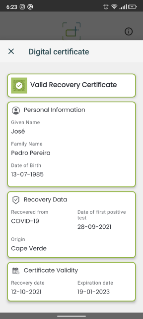
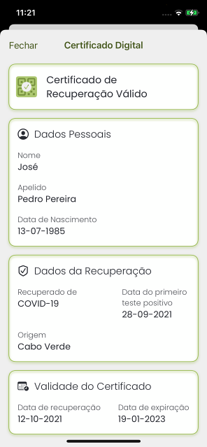

# Certificado de Recuperação Válido / Valid Recovery Certificate

## Decode Chain

### QR Code de teste / Test QR Code

### Conteúdo / Content

`HC1:NCFDB0Y50T9WUWGVLKE797/IZ-S8/HKGLH478CKI1TFN0URC78JWY0:GC8UC*703N8D97TK0F90GECQHGXJC/$ENF6PF64W5346*96WJCT3E3N8WJC0FD6A5AIA%G7X+AQB9F+AKG7O+AJ%6H:6A+9:W6809V*89IA4Y8G1A9+847ARHA009%JCOQE+Y9OSSZRIQ+94KCD3DX47B46IL6646H*6 .C6JD846Y96F465W5Y577VC6JD846Y96$964W5TG6..DX%DLPCG/D* D2Y8BIA5S7GY87Y8.HAZJC9/DG7AJVC82EG7AZKE*ED1ECI3D6WEXH9WNA JC1/DKI9PSESILO/EZKEZ967L6C56GVC*JC1A6Y473W5+/6+96FBBR40/ELA-99VABSHVOIXM5T86UV1E%EDHOU471I1BYP06MU*T8D1F14KN0ZX83G05F5*:QO5S%2L0B6L34 EK42AIF00U2+VH-SH81S/DPXMN%Y2R2L7EDR*IZZPX1G1QQF88% F5TIXD7QUDB1H TSKCE80WE/J-FC/ GGPB5CLTN7250D/K93Q9ZAUF99CH0FQZLVU/M/DHBXIEZLI8GQ:7.ACXSJO79ZE9XFAT*B28E LQWCKOF0N87C*UQVMC8I%WBZ/MDBTSFO-NKPJTPEQ:A4ILS6QDZK4XM0 W7WUC/Z08J7F*5$REHS5.78MI5QSSUIIECORMD7RE0375T39$J6 4KGF$7ADLHGHUNY47/9XRJWFW/R6GUVBX2MLT7U6KE861`

### Step 5 Prefixed

`HC1:NCFDB0Y50T9WUWGVLKE797/IZ-S8/HKGLH478CKI1TFN0URC78JWY0:GC8UC*703N8D97TK0F90GECQHGXJC/$ENF6PF64W5346*96WJCT3E3N8WJC0FD6A5AIA%G7X+AQB9F+AKG7O+AJ%6H:6A+9:W6809V*89IA4Y8G1A9+847ARHA009%JCOQE+Y9OSSZRIQ+94KCD3DX47B46IL6646H*6 .C6JD846Y96F465W5Y577VC6JD846Y96$964W5TG6..DX%DLPCG/D* D2Y8BIA5S7GY87Y8.HAZJC9/DG7AJVC82EG7AZKE*ED1ECI3D6WEXH9WNA JC1/DKI9PSESILO/EZKEZ967L6C56GVC*JC1A6Y473W5+/6+96FBBR40/ELA-99VABSHVOIXM5T86UV1E%EDHOU471I1BYP06MU*T8D1F14KN0ZX83G05F5*:QO5S%2L0B6L34 EK42AIF00U2+VH-SH81S/DPXMN%Y2R2L7EDR*IZZPX1G1QQF88% F5TIXD7QUDB1H TSKCE80WE/J-FC/ GGPB5CLTN7250D/K93Q9ZAUF99CH0FQZLVU/M/DHBXIEZLI8GQ:7.ACXSJO79ZE9XFAT*B28E LQWCKOF0N87C*UQVMC8I%WBZ/MDBTSFO-NKPJTPEQ:A4ILS6QDZK4XM0 W7WUC/Z08J7F*5$REHS5.78MI5QSSUIIECORMD7RE0375T39$J6 4KGF$7ADLHGHUNY47/9XRJWFW/R6GUVBX2MLT7U6KE861`

### Step 4 Encoded

`NCFDB0Y50T9WUWGVLKE797/IZ-S8/HKGLH478CKI1TFN0URC78JWY0:GC8UC*703N8D97TK0F90GECQHGXJC/$ENF6PF64W5346*96WJCT3E3N8WJC0FD6A5AIA%G7X+AQB9F+AKG7O+AJ%6H:6A+9:W6809V*89IA4Y8G1A9+847ARHA009%JCOQE+Y9OSSZRIQ+94KCD3DX47B46IL6646H*6 .C6JD846Y96F465W5Y577VC6JD846Y96$964W5TG6..DX%DLPCG/D* D2Y8BIA5S7GY87Y8.HAZJC9/DG7AJVC82EG7AZKE*ED1ECI3D6WEXH9WNA JC1/DKI9PSESILO/EZKEZ967L6C56GVC*JC1A6Y473W5+/6+96FBBR40/ELA-99VABSHVOIXM5T86UV1E%EDHOU471I1BYP06MU*T8D1F14KN0ZX83G05F5*:QO5S%2L0B6L34 EK42AIF00U2+VH-SH81S/DPXMN%Y2R2L7EDR*IZZPX1G1QQF88% F5TIXD7QUDB1H TSKCE80WE/J-FC/ GGPB5CLTN7250D/K93Q9ZAUF99CH0FQZLVU/M/DHBXIEZLI8GQ:7.ACXSJO79ZE9XFAT*B28E LQWCKOF0N87C*UQVMC8I%WBZ/MDBTSFO-NKPJTPEQ:A4ILS6QDZK4XM0 W7WUC/Z08J7F*5$REHS5.78MI5QSSUIIECORMD7RE0375T39$J6 4KGF$7ADLHGHUNY47/9XRJWFW/R6GUVBX2MLT7U6KE861`

### Step 3 Compressed

`[120, -38, 1, -4, 1, 3, -2, -46, -124, 78, -94, 4, 72, 122, -107, -8, -28, -44, -114, 16, -87, 1, 56, 36, -96, 88, -27, -92, 4, 26, 99, -55, -105, -70, 6, 26, 97, -24, 100, 58, 1, 98, 67, 86, 57, 1, 3, -95, 1, -92, 97, 114, -127, -89, 98, 100, 117, 106, 50, 48, 50, 50, 45, 49, 48, 45, 49, 50, 98, 99, 111, 98, 67, 86, 98, 99, 105, 120, 41, 85, 82, 78, 58, 85, 86, 67, 73, 58, 86, 49, 58, 67, 86, 58, 54, 55, 55, 67, 78, 67, +419 more]`

### Step 2 Cose

`[-46, -124, 78, -94, 4, 72, 122, -107, -8, -28, -44, -114, 16, -87, 1, 56, 36, -96, 88, -27, -92, 4, 26, 99, -55, -105, -70, 6, 26, 97, -24, 100, 58, 1, 98, 67, 86, 57, 1, 3, -95, 1, -92, 97, 114, -127, -89, 98, 100, 117, 106, 50, 48, 50, 50, 45, 49, 48, 45, 49, 50, 98, 99, 111, 98, 67, 86, 98, 99, 105, 120, 41, 85, 82, 78, 58, 85, 86, 67, 73, 58, 86, 49, 58, 67, 86, 58, 54, 55, 55, 67, 78, 67, 53, 66, 71, 57, 70, 66, 82, +408 more]`

### Step 1 Cwt

`[-92, 4, 26, 99, -55, -105, -70, 6, 26, 97, -24, 100, 58, 1, 98, 67, 86, 57, 1, 3, -95, 1, -92, 97, 114, -127, -89, 98, 100, 117, 106, 50, 48, 50, 50, 45, 49, 48, 45, 49, 50, 98, 99, 111, 98, 67, 86, 98, 99, 105, 120, 41, 85, 82, 78, 58, 85, 86, 67, 73, 58, 86, 49, 58, 67, 86, 58, 54, 55, 55, 67, 78, 67, 53, 66, 71, 57, 70, 66, 82, 77, 69, 70, 79, 87, 70, 89, 80, 89, 82, 50, 71, 49, 98, 105, 115, 104, 77, 83, -30, +129 more]`

### Raw

`{"r":[{"du":"2022-10-12","co":"CV","ci":"URN:UVCI:V1:CV:677CNC5BG9FBRMEFOWFYPYR2G1","is":"MS–DNS","tg":"840539006","fr":"2021-09-28","df":"2021-10-12"}],"nam":{"fnt":"PEDRO<PEREIRA","fn":"Pedro Pereira","gnt":"JOSE","gn":"José"},"ver":"1.3.0","dob":"1985-07-13"}`

### Resultado / Result

