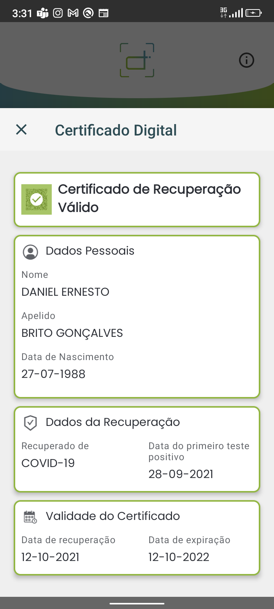

# Certificado de Recuperação Válido / Valid Recovery Certificate

## Decode Chain

### QR Code de teste / Test QR Code

### Conteúdo / Content

`HC1:NCFOXNYTS3DHTTKHTT /4ERVG+AXKBFS5$JVLWGYI5H3ULA7ZKLIPK-:F*E97FC:ZH6I1$4JF 2K%5+G9F.PNF65J6UW6LEQLR6PK911APK95%LPN1VUU8C1VTEAYM6O6%IEJTM27VH61I7FG71QSM 9VETUJS6LK61U1P4F%Z1-%66PPB7QYV15$Q*NRS/5AHLW 70SO:GOLIROGOAQ5G*L WCZJKOHG43MGY8PG94VGA1NEA7IB6$C94JB7D9HPA:3DL9O3XNSDS*.ER5K4DR: KRQ70MMC.U-LIJ.2708S0BAX0K344DRV62I%KMR7/JIFRMLNKNM8POCEUGP$I/XK$M8$H16YBDQENO47690%0*ATJ5FHFJE%02UUR3S.WF/.LZDEX8Q RBXYK04FCWQU:2LKA%YRLXJ.5LYAAY7S2 HY03DSLMZL.7R-6SYWPS8N4SD*WS+HFQQMBK3Y/1+ZNA8BP6U8KIX/9H$RJF3:/K-4VWJ54+L.426+DK/ALJI*G4ADIY+SD:T-:E33V$:JCAUO%29:5JPBEYTMF9JPJLULM-4FQN6-3-PSQDSM%BUV12ARLG73H1NXT*7V6CJM PZ8F./QH VE+FY0AUTFI$PDYC+UVPYJDMV*/9 3JBUK9NEG.O69K++3NNS%7NCZAJTKUVTGNVB2KLM18-E$:UQ66.5CZY5+.P-BD3QVF L:WBL95G8KHQNH33*9E/FE8A91KJNBPV SH-0-ZUTRP-XU.ZBWLQ41U6D75CM200NGC$4`

### Step 5 Prefixed

`HC1:NCFOXNYTS3DHTTKHTT /4ERVG+AXKBFS5$JVLWGYI5H3ULA7ZKLIPK-:F*E97FC:ZH6I1$4JF 2K%5+G9F.PNF65J6UW6LEQLR6PK911APK95%LPN1VUU8C1VTEAYM6O6%IEJTM27VH61I7FG71QSM 9VETUJS6LK61U1P4F%Z1-%66PPB7QYV15$Q*NRS/5AHLW 70SO:GOLIROGOAQ5G*L WCZJKOHG43MGY8PG94VGA1NEA7IB6$C94JB7D9HPA:3DL9O3XNSDS*.ER5K4DR: KRQ70MMC.U-LIJ.2708S0BAX0K344DRV62I%KMR7/JIFRMLNKNM8POCEUGP$I/XK$M8$H16YBDQENO47690%0*ATJ5FHFJE%02UUR3S.WF/.LZDEX8Q RBXYK04FCWQU:2LKA%YRLXJ.5LYAAY7S2 HY03DSLMZL.7R-6SYWPS8N4SD*WS+HFQQMBK3Y/1+ZNA8BP6U8KIX/9H$RJF3:/K-4VWJ54+L.426+DK/ALJI*G4ADIY+SD:T-:E33V$:JCAUO%29:5JPBEYTMF9JPJLULM-4FQN6-3-PSQDSM%BUV12ARLG73H1NXT*7V6CJM PZ8F./QH VE+FY0AUTFI$PDYC+UVPYJDMV*/9 3JBUK9NEG.O69K++3NNS%7NCZAJTKUVTGNVB2KLM18-E$:UQ66.5CZY5+.P-BD3QVF L:WBL95G8KHQNH33*9E/FE8A91KJNBPV SH-0-ZUTRP-XU.ZBWLQ41U6D75CM200NGC$4`

### Step 4 Encoded

`NCFOXNYTS3DHTTKHTT /4ERVG+AXKBFS5$JVLWGYI5H3ULA7ZKLIPK-:F*E97FC:ZH6I1$4JF 2K%5+G9F.PNF65J6UW6LEQLR6PK911APK95%LPN1VUU8C1VTEAYM6O6%IEJTM27VH61I7FG71QSM 9VETUJS6LK61U1P4F%Z1-%66PPB7QYV15$Q*NRS/5AHLW 70SO:GOLIROGOAQ5G*L WCZJKOHG43MGY8PG94VGA1NEA7IB6$C94JB7D9HPA:3DL9O3XNSDS*.ER5K4DR: KRQ70MMC.U-LIJ.2708S0BAX0K344DRV62I%KMR7/JIFRMLNKNM8POCEUGP$I/XK$M8$H16YBDQENO47690%0*ATJ5FHFJE%02UUR3S.WF/.LZDEX8Q RBXYK04FCWQU:2LKA%YRLXJ.5LYAAY7S2 HY03DSLMZL.7R-6SYWPS8N4SD*WS+HFQQMBK3Y/1+ZNA8BP6U8KIX/9H$RJF3:/K-4VWJ54+L.426+DK/ALJI*G4ADIY+SD:T-:E33V$:JCAUO%29:5JPBEYTMF9JPJLULM-4FQN6-3-PSQDSM%BUV12ARLG73H1NXT*7V6CJM PZ8F./QH VE+FY0AUTFI$PDYC+UVPYJDMV*/9 3JBUK9NEG.O69K++3NNS%7NCZAJTKUVTGNVB2KLM18-E$:UQ66.5CZY5+.P-BD3QVF L:WBL95G8KHQNH33*9E/FE8A91KJNBPV SH-0-ZUTRP-XU.ZBWLQ41U6D75CM200NGC$4`

### Step 3 Compressed

`[120, -38, -69, -44, -30, -73, -120, -59, -93, 106, -22, -113, 39, 87, -6, 4, 86, 50, 90, -88, 44, -120, -8, -77, -124, 69, 42, -39, -19, -26, 57, 54, -87, -60, -94, -85, 126, -116, 73, -50, 97, -106, -116, -52, 11, 25, -105, 36, 22, 53, 46, 79, 74, 41, -51, 50, 50, 48, 50, -46, 53, 52, -48, 53, 52, 74, 74, -50, 79, 72, 74, -50, -84, -48, 12, 13, -14, -77, 10, 13, 115, -10, -76, 10, 51, -76, 114, 14, -77, 50, -10, 116, 9, 8, 119, -12, 9, 52, -77, 12, -10, -16, -14, 117, 52, 117, 51, 15, 13, 48, 119, 116, 14, 54, 54, 77, -54, 44, -50, -16, 13, 126, -44, 48, -39, -59, 47, 56, -87, 36, 61, -45, -62, -60, -64, -44, -40, -46, -64, -64, 44, 41, -83, 8, 100, -80, -95, -82, -127, -91, -82, -111, 69, 82, 74, 26, -124, 7, -74, 38, 57, 47, 49, 119, 73, 114, 90, 94, 73, -127, 83, -112, 103, -120, -65, -126, -69, -65, -33, -31, 118, 71, -97, 48, -41, -32, -92, -76, 60, 12, -79, -28, -12, -68, -110, 60, 23, 71, 63, 79, 87, 31, 5, -41, 32, 63, -41, -32, 16, -1, -92, -12, 60, 52, -111, -28, -78, -44, -94, 84, 67, 61, 99, 61, -125, -28, -108, -4, -92, 44, 67, 75, 11, 11, 93, 3, 115, 93, 35, -13, 72, 70, 6, -82, -25, 78, 119, -101, -104, -1, 6, -68, -14, -106, -34, 30, 124, 113, -83, -86, 113, 42, -49, 51, 91, -26, -92, 79, 119, 91, -45, 86, 23, -84, 82, -77, -37, -77, -100, 45, -89, 40, 80, -2, -34, -39, -116, -49, 23, -35, -85, 22, -84, 90, -42, -8, -34, -77, -53, -125, -73, 115, 107, -59, -29, 67, 121, -52, -78, -78, 27, 74, 15, -102, -68, 62, 88, 117, -18, 117, -111, -18, 78, -31, -36, 37, 26, 113, -91, -17, -10, 20, 43, 4, -83, 41, 16, -80, 109, -29, 86, -67, -111, -50, 34, -101, -112, -75, -28, -90, -19, 46, 118, -93, -11, -63, -98, 44, -17, 28, 22, -104, 47, 82, 91, 123, -21, 109, 73, -22, -102, -61, -85, 120, 38, -17, -70, -112, 30, -10, -30, 10, -33, -33, 93, -57, 13, 122, -41, 87, 58, 68, 10, -23, -21, 73, -10, -103, -104, 109, -52, 43, 120, 50, -43, 99, -5, -100, 125, -67, 79, 60, 123, -34, -52, 84, 100, -13, -6, -91, -100, 94, -7, 34, 78, -25, -106, -10, -93, -123, 114, -46, -59, 74, -97, -49, 30, -21, -31, -98, -73, 80, 85, 77, -93, 96, -22, -10, -7, 82, -98, -103, 11, -36, 117, -5, -11, 47, 48, -98, 95, -9, 45, -86, -51, 75, 104, -19, -7, -52, -84, -128, 92, -49, 41, 55, -97, -84, -70, -110, 24, 83, 112, 122, 113, -116, 72, -5, -103, -48, -57, -57, -29, -17, 7, 70, -13, -98, -54, -99, -13, 68, 93, 84, -47, 123, -19, 127, 57, -82, -80, 39, 0, 2, 97, -45, -39]`

### Step 2 Cose

`[-46, -124, 78, -94, 4, 72, 122, -107, -8, -28, -44, -114, 16, -87, 1, 56, 36, -96, 88, -4, -92, 4, 26, 99, 70, -39, -50, 6, 26, 97, 114, -43, 78, 1, 98, 67, 86, 57, 1, 3, -95, 1, -92, 97, 114, -127, -89, 98, 100, 117, 106, 50, 48, 50, 50, 45, 49, 48, 45, 49, 50, 98, 99, 111, 96, 98, 99, 105, 120, 41, 85, 82, 78, 58, 85, 86, 67, 73, 58, 86, 49, 58, 67, 86, 58, 51, 73, 68, 80, 87, 65, 76, 81, 54, 57, 83, 72, 74, 77, 65, 53, 70, 55, 85, 80, 55, 65, 67, 83, 51, 53, 98, 105, 115, 104, 77, 83, -30, -128, -109, 68, 78, 83, 98, 116, 103, 105, 56, 52, 48, 53, 51, 57, 48, 48, 54, 98, 102, 114, 106, 50, 48, 50, 49, 45, 48, 57, 45, 50, 56, 98, 100, 102, 106, 50, 48, 50, 49, 45, 49, 48, 45, 49, 50, 99, 110, 97, 109, -92, 99, 102, 110, 116, 112, 66, 82, 73, 84, 79, 32, 71, 79, 78, -61, -121, 65, 76, 86, 69, 83, 98, 102, 110, 112, 66, 82, 73, 84, 79, 32, 71, 79, 78, -61, -121, 65, 76, 86, 69, 83, 99, 103, 110, 116, 110, 68, 65, 78, 73, 69, 76, 32, 69, 82, 78, 69, 83, 84, 79, 98, 103, 110, 110, 68, 65, 78, 73, 69, 76, 32, 69, 82, 78, 69, 83, 84, 79, 99, 118, 101, 114, 101, 49, 46, 51, 46, 48, 99, 100, 111, 98, 106, 49, 57, 56, 56, 45, 48, 55, 45, 50, 55, 89, 1, 0, 10, -25, 66, -35, -126, 3, -3, 80, -22, 75, 27, -73, 83, -47, -83, 37, 51, 101, 12, -26, 61, 3, 98, -14, -35, -123, 102, -85, 112, -86, 38, 62, -68, -89, 6, 108, 114, 81, 31, -34, -51, 104, -13, -47, 71, 122, -96, -86, -90, -127, -17, 73, -118, 72, 13, -119, -75, 120, -29, -62, 110, 3, 29, 29, -80, 117, -63, 52, -21, -63, 122, -50, -21, 114, 45, -71, 19, 109, -92, 40, 94, 117, -18, -68, 115, 32, 82, -84, 112, 16, 61, -122, 11, 37, -40, 103, 4, 29, 96, 106, -92, -39, 61, -70, 7, 50, -81, 83, 73, 4, -18, 64, -96, 55, -94, 38, -83, -38, -19, 116, 101, -84, -61, -86, 12, -109, -70, -48, 103, 86, -24, -44, 14, -3, -70, -57, 48, -115, -81, 121, 64, 89, 18, 47, 46, 25, -114, 52, 54, -79, 110, 112, -28, -107, 72, -73, -100, -66, -115, -28, 73, -116, -20, -103, 33, 6, 74, -6, 35, 103, 121, -24, 94, 44, -38, 43, -30, -95, 30, 27, 115, 34, -13, -51, -58, -116, 11, -98, -95, 37, 38, 40, 112, -107, -73, -97, 26, 73, 105, -96, 71, 45, -113, 47, -48, 1, -49, -82, -10, 90, -122, 74, 18, -83, -49, 105, 106, 80, 109, 73, -108, -39, -28, -86, -44, 97, 92, 112, -53, -93, 92, 20, -121, -52, 85, -29, -57, 95, -33, 81, 91, 13, -54, 109, -100, -28, 39, 21, 33, 75, -83, -1, 30, 10, 86, -28]`

### Step 1 Cwt

`[-92, 4, 26, 99, 70, -39, -50, 6, 26, 97, 114, -43, 78, 1, 98, 67, 86, 57, 1, 3, -95, 1, -92, 97, 114, -127, -89, 98, 100, 117, 106, 50, 48, 50, 50, 45, 49, 48, 45, 49, 50, 98, 99, 111, 96, 98, 99, 105, 120, 41, 85, 82, 78, 58, 85, 86, 67, 73, 58, 86, 49, 58, 67, 86, 58, 51, 73, 68, 80, 87, 65, 76, 81, 54, 57, 83, 72, 74, 77, 65, 53, 70, 55, 85, 80, 55, 65, 67, 83, 51, 53, 98, 105, 115, 104, 77, 83, -30, -128, -109, 68, 78, 83, 98, 116, 103, 105, 56, 52, 48, 53, 51, 57, 48, 48, 54, 98, 102, 114, 106, 50, 48, 50, 49, 45, 48, 57, 45, 50, 56, 98, 100, 102, 106, 50, 48, 50, 49, 45, 49, 48, 45, 49, 50, 99, 110, 97, 109, -92, 99, 102, 110, 116, 112, 66, 82, 73, 84, 79, 32, 71, 79, 78, -61, -121, 65, 76, 86, 69, 83, 98, 102, 110, 112, 66, 82, 73, 84, 79, 32, 71, 79, 78, -61, -121, 65, 76, 86, 69, 83, 99, 103, 110, 116, 110, 68, 65, 78, 73, 69, 76, 32, 69, 82, 78, 69, 83, 84, 79, 98, 103, 110, 110, 68, 65, 78, 73, 69, 76, 32, 69, 82, 78, 69, 83, 84, 79, 99, 118, 101, 114, 101, 49, 46, 51, 46, 48, 99, 100, 111, 98, 106, 49, 57, 56, 56, 45, 48, 55, 45, 50, 55]`

### Raw

`{"r":[{"du":"2022-10-12","co":"","ci":"URN:UVCI:V1:CV:3IDPWALQ69SHJMA5F7UP7ACS35","is":"MS–DNS","tg":"840539006","fr":"2021-09-28","df":"2021-10-12"}],"nam":{"fnt":"BRITO GONÇALVES","fn":"BRITO GONÇALVES","gnt":"DANIEL ERNESTO","gn":"DANIEL ERNESTO"},"ver":"1.3.0","dob":"1988-07-27"}`

### Resultado / Result

