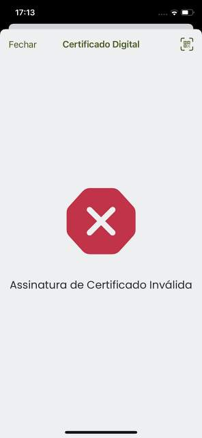

# Certificado com assinatura digital não reconhecida / Certificate with unrecognized digital signature

## Decode Chain

### QR Code de teste / Test QR Code

### Conteúdo / Content

`HC1:NCFOXN%TSMAHN-HYVKOM6VORZEMIZ23J4LR5QR9U21OGIYQ15C4M*4RCM1$8 NI4EFSYS:%OD3PYE9*FJUKBAZ8-.A2*CEHJ5$0BRVDD4:HO85O/RVGE85$0S.8**4H0DM%2K8AZOM1JAF.7HELDXI25P9ZI4Q5%H0AN8%H0PZBITHP+PITC6FV*$K3$OHBW24FAL86H0YQCEZK.IA.C8KRDL4O54O4IGUJKJGI0JAXD15IAXMFU*GSHGRKMXGG6DBYCB-1JMJKR.KSHGXGG*EDZI9$JAQJKH+GX2MELNJIKSKE MCAOI8%MI*RF*QGOKL*GT*QQ+Q/PKI%KH N7BM1US+M5XZQNI95J0/ B1-VJD0DRG.Y7PR3YZQ H95+NERGZUIOAGIY1VS11O1MP3S-5GWKGRI- ANQDRAQ8R2V1LDCQ2ZQEZMPUNDRBRFD5/1SFITFW24PAAL3FV$HCC%4K9M5NNBTLPKB%RCHCU*CCZM6PMT:3QUTV*-4DHRCAF`

### Step 5 Prefixed

`HC1:NCFOXNYTS3DHVQGF0L:7S$HFMF5+K1UV0:ZHSN9HXK*HN:P8HXKXE7X$GK$4C:GPF6R:5SVBHABVCN395J4IL95OD6%28%%BDDQZ019.PCY5HOP+MMBT16Y51Y9AT1 %P6IAXPMHQ1*P1MX1+ZEE 9:PIXTIQWOWLIZK53O8J.V J8$XJM/L5R1  J8ZLBXJWD4*L4:%B*U72+R2Y9K%J 0OR$9XF8IR9UXFZIEQKERQ8IY1I$H3:U8 9QS5OH6+M6.PG9X6T1FEJ1UF5LDCPF5RBQ746B466 0D4D$ZJ*DJ3Q4+Y5.T4K9E5EBIEA/H86:F1FEMIA+Z3U:7-Z7WT4KA7+05PCNJW6GW743PG%5TW5A 6+O6XL69/9-3AKI6-$MLEQ*FMSW6-AH-VCYCV*BJ2.MLTHKAPOWNN8N4SUZ$F*TE1%0LXD/RT+B0Q+K6*8C.S6%VDTPO.63*84S7:YNIGAW.U-T44PTD-1U/HB.9JKFRVCWEM$FPJ C:4ED5NFJ7AUB*ZJ4:4QNQX*I6LGUXPNBOTFCQ5EFSV 462VVM9MP%QUVIYQ112JI5CGJR+/7LN7.OM6BSR3OSRJP/OFTPYWJVO59$O3:5GYC-5UJ4J0DORJ3$1GWLOK8N%T79FUDM6%.IU-IABMWXA5/T%3B3V85JK6FB.BTBECQNS9/P47S76KOFP*NEOEN82B52UOWM+Z628T%NI9PN6BN2FRU.JC92V4B$OSBS2/.OJ4L%ONEPB%UV/4K:28G8FIXNWIUI+I/BRMIJ31DL*302DPDC0HN60U-YE4$NFQ7V33T%Q`

### Step 4 Encoded

`NCFOXN%TSMAHN-HYVKOM6VORZEMIZ23J4LR5QR9U21OGIYQ15C4M*4RCM1$8 NI4EFSYS:%OD3PYE9*FJUKBAZ8-.A2*CEHJ5$0BRVDD4:HO85O/RVGE85$0S.8**4H0DM%2K8AZOM1JAF.7HELDXI25P9ZI4Q5%H0AN8%H0PZBITHP+PITC6FV*$K3$OHBW24FAL86H0YQCEZK.IA.C8KRDL4O54O4IGUJKJGI0JAXD15IAXMFU*GSHGRKMXGG6DBYCB-1JMJKR.KSHGXGG*EDZI9$JAQJKH+GX2MELNJIKSKE MCAOI8%MI*RF*QGOKL*GT*QQ+Q/PKI%KH N7BM1US+M5XZQNI95J0/ B1-VJD0DRG.Y7PR3YZQ H95+NERGZUIOAGIY1VS11O1MP3S-5GWKGRI- ANQDRAQ8R2V1LDCQ2ZQEZMPUNDRBRFD5/1SFITFW24PAAL3FV$HCC%4K9M5NNBTLPKB%RCHCU*CCZM6PMT:3QUTV*-4DHRCAF`

### Step 3 Compressed

`[120, -38, -69, -44, -30, -69, -120, 81, -115, -59, -93, -55, 51, 108, -39, -22, -80, -97, 22, 11, 34, -2, 44, 97, 76, 10, 8, 97, -111, 74, 12, -99, 33, -59, 38, -107, -80, 61, 69, -54, -110, -111, 121, 33, -29, -110, -60, -78, -58, 85, 73, -55, -103, 21, 90, -91, 69, 121, 86, -91, 101, -55, -103, 86, 6, -122, -6, 1, 33, -6, -63, 1, -66, -63, -6, 33, 65, -50, 6, -122, 70, -58, 38, -90, 102, -26, 22, -106, 80, -106, -78, 97, 82, 114, 62, -48, -88, -92, -108, 60, -58, -92, -108, -110, 44, 35, 3, 35, 67, 93, 3, 35, 93, 67, -117, -92, -52, -30, 100, 23, -9, -32, -92, -36, -60, 92, -1, 32, 119, 93, 67, 3, 3, 3, 99, -96, -92, 105, 82, 110, 65, -114, 107, -88, -66, -95, -66, -111, -127, -66, -95, -87, -111, 69, 82, 113, 10, 83, 82, 73, 122, -90, -123, -119, -127, -87, -79, -91, -127, -127, 89, 82, 89, 65, -106, -95, -95, -95, -91, -79, -127, -87, -127, -127, 105, 114, 74, 126, 82, -106, -95, -91, -123, -87, -82, -127, -71, -82, -95, 113, 114, 94, 98, -18, -110, -92, -76, -68, -36, -128, -44, -108, -94, 124, -123, -128, -44, -94, -44, -52, -94, -60, -92, -12, -68, 84, -81, -4, -30, -61, 43, -109, -45, -14, 74, 114, 3, 92, 93, -126, -4, 109, 2, 92, -125, 92, 61, -125, 28, -109, -45, -13, 74, 82, -68, -4, -125, 93, -109, -53, -128, 106, 13, -11, 12, -12, 12, 34, 28, 54, 46, -34, -93, -28, -109, 49, 85, -105, 107, 126, -49, -121, 20, -103, -90, 105, -49, -45, -45, -45, -76, 59, -69, 78, 91, -49, 105, -109, 15, 125, -111, 33, -1, -32, -58, 119, -89, -23, -9, -35, 98, 14, 38, 94, -81, -81, -71, -1, -85, 65, 90, -96, 99, -47, -17, 123, 97, 47, 51, 119, -23, 92, -50, 93, -6, 110, 39, 0, -40, -99, 120, 117]`

### Step 2 Cose

`[-46, -124, 77, -94, 1, 38, 4, 72, -126, 73, 86, -90, -85, 86, -7, 56, -96, 88, -4, -92, 1, 98, 80, 84, 4, 26, 97, 85, -104, 26, 6, 26, 96, -73, 100, 26, 57, 1, 3, -95, 1, -92, 97, 118, -127, -86, 98, 99, 105, 120, 42, 117, 114, 110, 58, 117, 118, 99, 105, 58, 48, 49, 47, 80, 84, 47, 83, 80, 77, 83, 47, 84, 82, 67, 48, 49, 50, 51, 52, 53, 54, 55, 56, 57, 48, 49, 50, 51, 52, 53, 54, 35, 49, 98, 99, 111, 98, 80, 84, 98, 100, 110, 1, 98, 100, 116, 106, 50, 48, 50, 49, 45, 48, 50, 45, 49, 56, 98, 105, 115, 99, 68, 71, 83, 98, 109, 97, 109, 79, 82, 71, 45, 49, 48, 48, 48, 51, 48, 50, 49, 53, 98, 109, 112, 108, 69, 85, 47, 49, 47, 50, 48, 47, 49, 53, 50, 56, 98, 115, 100, 2, 98, 116, 103, 105, 56, 52, 48, 53, 51, 57, 48, 48, 54, 98, 118, 112, 106, 49, 49, 49, 57, 51, 48, 53, 48, 48, 53, 99, 100, 111, 98, 106, 49, 57, 56, 53, 45, 48, 55, 45, 49, 51, 99, 110, 97, 109, -92, 98, 102, 110, 109, 80, 101, 100, 114, 111, 32, 80, 101, 114, 101, 105, 114, 97, 98, 103, 110, 101, 74, 111, 115, -61, -87, 99, 102, 110, 116, 109, 80, 69, 68, 82, 79, 60, 80, 69, 82, 69, 73, 82, 65, 99, 103, 110, 116, 100, 74, 79, 83, 69, 99, 118, 101, 114, 101, 49, 46, 48, 46, 48, 88, 64, -79, -93, -68, 34, 76, 104, -107, 45, 10, -97, -116, -16, 100, 28, -126, -106, -25, 103, 103, 102, 43, -119, -118, -53, 59, -100, -122, 31, 85, -24, 104, 31, -32, -40, -9, 66, -105, -33, 70, 92, -63, 97, -41, 127, 124, -33, -6, -128, 27, 16, -120, -94, -5, -34, 86, -23, 105, -70, 44, -45, 109, -91, -18, -71]`

### Step 1 Cwt

`null`

### Verification Result

`VerificationResult(expirationTime=null, issuedAt=null, issuer=null, certificateValidFrom=null, certificateValidUntil=null, certificateValidContent=[TEST, VACCINATION, RECOVERY], certificateSubjectCountry=null, content=[], error=KEY_NOT_IN_TRUST_LIST, errorDetails=null)`

### Resultado / Result

