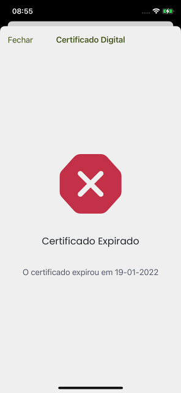

# Certificado expirado / Expired certificate

## Decode Chain

### QR Code de teste / Test QR Code

### Conteúdo / Content

`HC1:NCFA60NG0/3WUWGVLKE797/IZ-S8/HKGLH479CKV503XK3F39FTJRK3F39FTERK0JCN+AY50.FK6ZK7:EDOLFVCPD0B$D% D3IA4W5646946846.966KCN9E%961A6DL6FA7D46XJCCWENF6OF63W59%6QF6WJCT3E3N8WJC0FD6A5AIA%G7X+AQB9F+AKG7O+AJ%6H:6A+9:W6809V*89IA4Y8G1A9+847ARHA009.JCP9EJY8L/5M/5 96.96WF6%JCOQE+Y9OSSZRIQ+93KC.SC4KCD3DX47B46IL6646I*6..DX%DLPCG/D* D2Y8BIA5S7GY87Y8.HAZJC9/DG7AJVC82EG7AZKE*ED1ECI3D6WEXH9WNA JC1/DKI9PSESILO/EZKEZ967L6C56GVC*JC1A6Y473W5+/6+96FBBI10QOI$A7JZIQ673EUY4BCTOU65 AF.FTWTL0I6B O9GMX9T-JD 1N06M7DF60AIME HN.133/D%D5ZP6C A $N:*A+VC-G9OZK5%VS+7QPLED2U0FX CNDIL%9*3SJM7 G25+DFELF56J F02NOHF 0A.1W/G3//NS6I62G-:Q8YQ4GI6XP:5B..AD2V1.C8J3EZ4+9EFZPUCM.Q36RKZ1CD1JVJC/.7$DUB-HEGMXYDMDO0L8G0H5U9:HM%Y21SEU38C68P:6VWDC19.4AJ035A8:06U$SEUP6ZS36NGK0$OA32T4032BT1281JTY-7M%O-2O IB41NFSHYU2 MOW.OH223.F%32J1GEL11BA1NJ4URDAUG%O2RHG8BD1W:9P+9L/0`

### Step 5 Prefixed

`HC1:NCFA60NG0/3WUWGVLKE797/IZ-S8/HKGLH479CKV503XK3F39FTJRK3F39FTERK0JCN+AY50.FK6ZK7:EDOLFVCPD0B$D% D3IA4W5646946846.966KCN9E%961A6DL6FA7D46XJCCWENF6OF63W59%6QF6WJCT3E3N8WJC0FD6A5AIA%G7X+AQB9F+AKG7O+AJ%6H:6A+9:W6809V*89IA4Y8G1A9+847ARHA009.JCP9EJY8L/5M/5 96.96WF6%JCOQE+Y9OSSZRIQ+93KC.SC4KCD3DX47B46IL6646I*6..DX%DLPCG/D* D2Y8BIA5S7GY87Y8.HAZJC9/DG7AJVC82EG7AZKE*ED1ECI3D6WEXH9WNA JC1/DKI9PSESILO/EZKEZ967L6C56GVC*JC1A6Y473W5+/6+96FBBI10QOI$A7JZIQ673EUY4BCTOU65 AF.FTWTL0I6B O9GMX9T-JD 1N06M7DF60AIME HN.133/D%D5ZP6C A $N:*A+VC-G9OZK5%VS+7QPLED2U0FX CNDIL%9*3SJM7 G25+DFELF56J F02NOHF 0A.1W/G3//NS6I62G-:Q8YQ4GI6XP:5B..AD2V1.C8J3EZ4+9EFZPUCM.Q36RKZ1CD1JVJC/.7$DUB-HEGMXYDMDO0L8G0H5U9:HM%Y21SEU38C68P:6VWDC19.4AJ035A8:06U$SEUP6ZS36NGK0$OA32T4032BT1281JTY-7M%O-2O IB41NFSHYU2 MOW.OH223.F%32J1GEL11BA1NJ4URDAUG%O2RHG8BD1W:9P+9L/0`

### Step 4 Encoded

`NCFA60NG0/3WUWGVLKE797/IZ-S8/HKGLH479CKV503XK3F39FTJRK3F39FTERK0JCN+AY50.FK6ZK7:EDOLFVCPD0B$D% D3IA4W5646946846.966KCN9E%961A6DL6FA7D46XJCCWENF6OF63W59%6QF6WJCT3E3N8WJC0FD6A5AIA%G7X+AQB9F+AKG7O+AJ%6H:6A+9:W6809V*89IA4Y8G1A9+847ARHA009.JCP9EJY8L/5M/5 96.96WF6%JCOQE+Y9OSSZRIQ+93KC.SC4KCD3DX47B46IL6646I*6..DX%DLPCG/D* D2Y8BIA5S7GY87Y8.HAZJC9/DG7AJVC82EG7AZKE*ED1ECI3D6WEXH9WNA JC1/DKI9PSESILO/EZKEZ967L6C56GVC*JC1A6Y473W5+/6+96FBBI10QOI$A7JZIQ673EUY4BCTOU65 AF.FTWTL0I6B O9GMX9T-JD 1N06M7DF60AIME HN.133/D%D5ZP6C A $N:*A+VC-G9OZK5%VS+7QPLED2U0FX CNDIL%9*3SJM7 G25+DFELF56J F02NOHF 0A.1W/G3//NS6I62G-:Q8YQ4GI6XP:5B..AD2V1.C8J3EZ4+9EFZPUCM.Q36RKZ1CD1JVJC/.7$DUB-HEGMXYDMDO0L8G0H5U9:HM%Y21SEU38C68P:6VWDC19.4AJ035A8:06U$SEUP6ZS36NGK0$OA32T4032BT1281JTY-7M%O-2O IB41NFSHYU2 MOW.OH223.F%32J1GEL11BA1NJ4URDAUG%O2RHG8BD1W:9P+9L/0`

### Step 3 Compressed

`[120, -38, 1, 24, 2, -25, -3, -46, -124, 78, -94, 4, 72, 122, -107, -8, -28, -44, -114, 16, -87, 1, 56, 36, -96, 89, 1, 0, -92, 4, 26, 97, -24, 17, -93, 6, 26, 97, -24, 17, -93, 1, 98, 67, 86, 57, 1, 3, -95, 1, -92, 97, 118, -127, -86, 98, 100, 110, 2, 98, 109, 97, 109, 79, 82, 71, 45, 49, 48, 48, 48, 51, 48, 50, 49, 53, 98, 118, 112, 106, 49, 49, 49, 57, 51, 52, 57, 48, 48, 55, 98, 100, 116, 106, 50, 48, 50, 49, 45, 48, +447 more]`

### Step 2 Cose

`[-46, -124, 78, -94, 4, 72, 122, -107, -8, -28, -44, -114, 16, -87, 1, 56, 36, -96, 89, 1, 0, -92, 4, 26, 97, -24, 17, -93, 6, 26, 97, -24, 17, -93, 1, 98, 67, 86, 57, 1, 3, -95, 1, -92, 97, 118, -127, -86, 98, 100, 110, 2, 98, 109, 97, 109, 79, 82, 71, 45, 49, 48, 48, 48, 51, 48, 50, 49, 53, 98, 118, 112, 106, 49, 49, 49, 57, 51, 52, 57, 48, 48, 55, 98, 100, 116, 106, 50, 48, 50, 49, 45, 48, 54, 45, 50, 51, 98, 99, 111, +436 more]`

### Step 1 Cwt

`[-92, 4, 26, 97, -24, 17, -93, 6, 26, 97, -24, 17, -93, 1, 98, 67, 86, 57, 1, 3, -95, 1, -92, 97, 118, -127, -86, 98, 100, 110, 2, 98, 109, 97, 109, 79, 82, 71, 45, 49, 48, 48, 48, 51, 48, 50, 49, 53, 98, 118, 112, 106, 49, 49, 49, 57, 51, 52, 57, 48, 48, 55, 98, 100, 116, 106, 50, 48, 50, 49, 45, 48, 54, 45, 50, 51, 98, 99, 111, 98, 67, 86, 98, 99, 105, 120, 41, 85, 82, 78, 58, 85, 86, 67, 73, 58, 86, 49, 58, 67, +156 more]`

### Raw

`null`

### Verification Result

`VerificationResult(expirationTime=2022-01-19T13:26:59Z, issuedAt=2022-01-19T13:26:59Z, issuer=CV, certificateValidFrom=2021-08-16T01:35:35Z, certificateValidUntil=2026-08-15T01:35:35Z, certificateValidContent=[TEST, VACCINATION, RECOVERY], certificateSubjectCountry=gov, content=[], error=CWT_EXPIRED, errorDetails={expirationTime=2022-01-19T13:26:59Z, currentTime=2022-01-19T13:40:12.209Z})`

### Resultado / Result

