# Cabo Verde - NhaCard Certificado Digital

## 1.3.0 schema

### 1. Certificados Válidos - Valid Certificates

### 1.1. Certificado de Vacinação válido / Valid Vaccine Certificate

* [Resultado de Decode](1/1.1/README.md)

* [QR Code](1/1.1/qr.png)
  
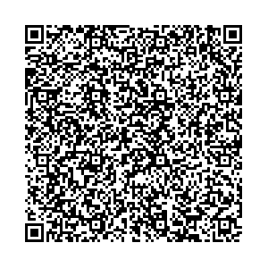

* [Resultado esperado de leitura Android](1/1.1/result-android.png)
* [Resultado esperado de leitura iOS](1/1.1/result-android.png)
  
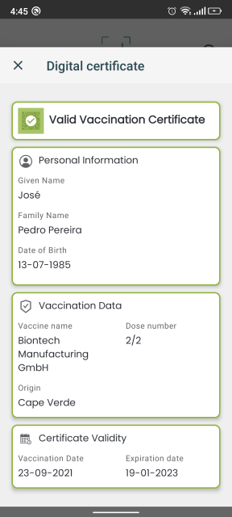
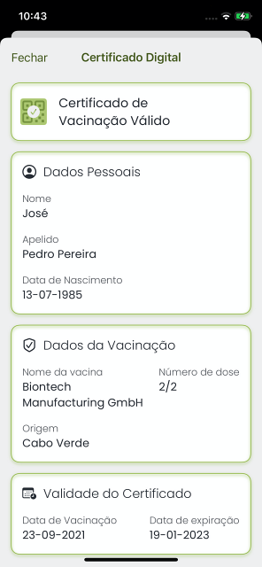

### 1.2. Certificado de Teste válido / Valid Test Certificate

* [Resultado de Decode](1/1.2/README.md)

* [QR Code](1/1.2/qr.png)

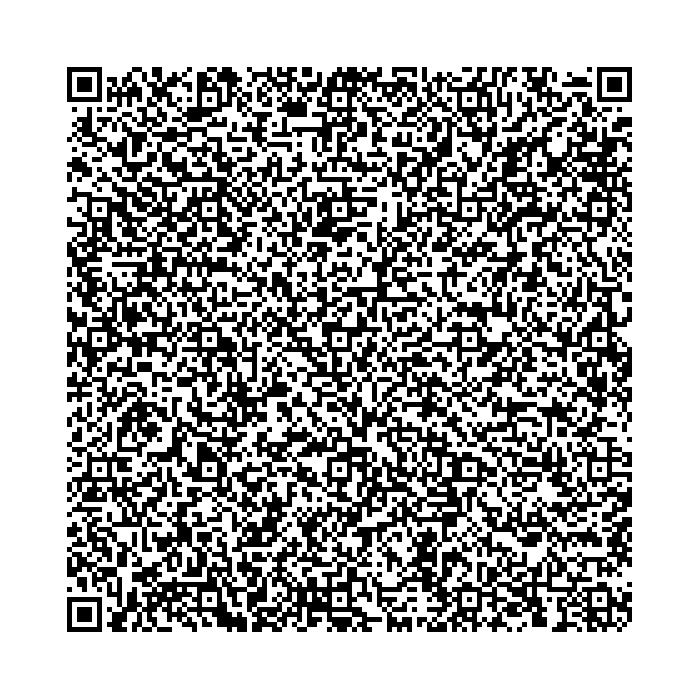

* [Resultado esperado de leitura Android](1/1.2/result-android.png)
* [Resultado esperado de leitura iOS](1/1.2/result-ios.png)

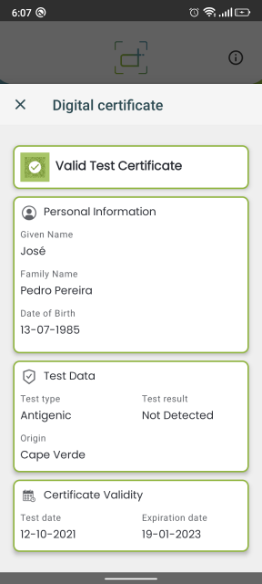
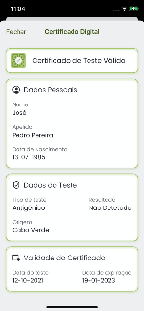

### 1.3. Certificado de Recuperação válido / Valid Recovery Certificate

* [Resultado de Decode](1/1.3/README.md)

* [QR Code](1/1.3/qr.png)

* [Resultado esperado de leitura Android](1/1.3/result-android.png)
* [Resultado esperado de leitura iOS](1/1.3/result-ios.png)

### 2. Certificado com assinatura digital não reconhecida / Certificate with unrecognized digital signature

* [Resultado de Decode](2/README.md)

* [QR Code](2/qr.png)

* [Resultado esperado de leitura Android](2/result-android.png)
* [Resultado esperado de leitura iOS](2/result-ios.png)

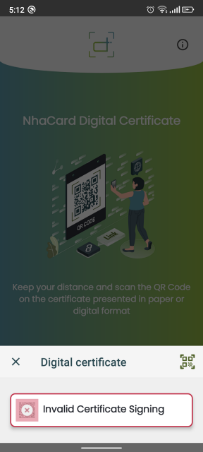
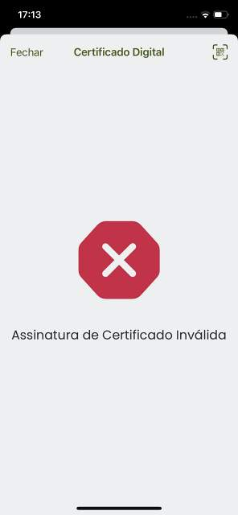

### 3. Certificado expirado / Expired certificate

* [Resultado de Decode](3/README.md)

* [QR Code](3/qr.png)

* [Resultado esperado de leitura Android](3/result-android.png)
* [Resultado esperado de leitura iOS](3/result-ios.png)

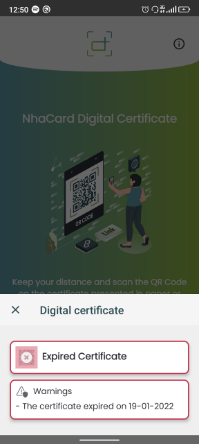
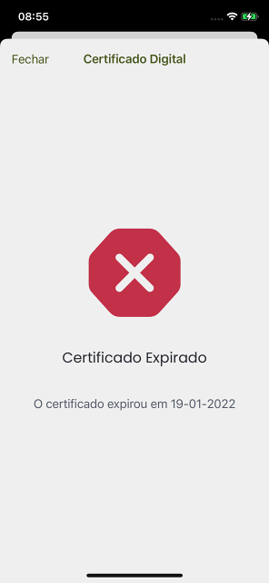

### 4. Conteúdo de QR Code inválido / Invalid QR Code Content

* [Resultado de Decode](4/README.md)

* [QR Code](4/qr.png)

* [Resultado esperado de leitura Android](4/result-android.png)
* [Resultado esperado de leitura iOS](4/result-ios.png)

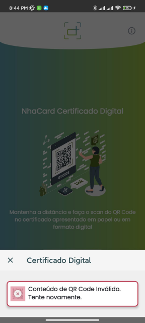
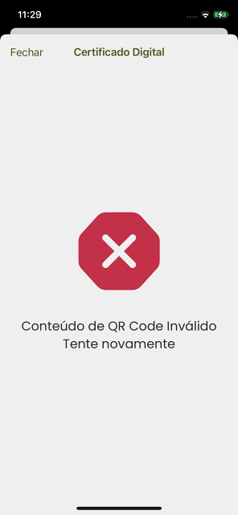