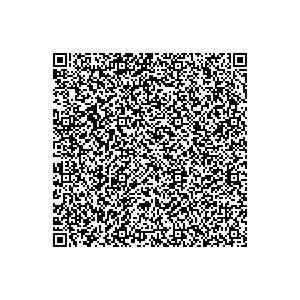
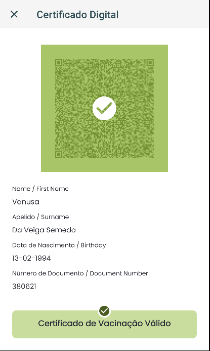
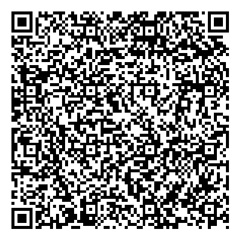
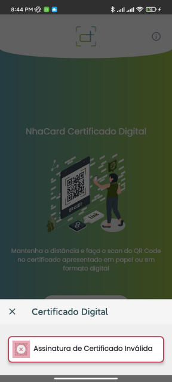
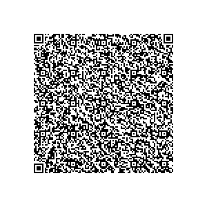
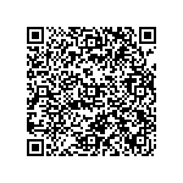
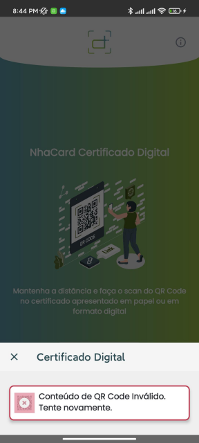

# Cabo Verde - NhaCard Certificado Digital

## 1.3.0 schema

### 1. Certificado Válido

* [Resultado de Decode](1/README.md)

* [QR Code](1/qr.png)
  

* [Resultado esperado de leitura](1/result.png)
  

### 2. Certificado com assinatura digital não reconhecida

* [Resultado de Decode](2/README.md)

* [QR Code](2/qr.png)

* [Resultado esperado de leitura](2/result.png)

### 3. Certificado expirado

* [Resultado de Decode](3/README.md)

* [QR Code](3/qr.png)

* [Resultado esperado de leitura](3/result.png)

### 4. Conteúdo de QR Code inválido

* [Resultado de Decode](4/README.md)

* [QR Code](4/qr.png)

* [Resultado esperado de leitura](4/result.png)

